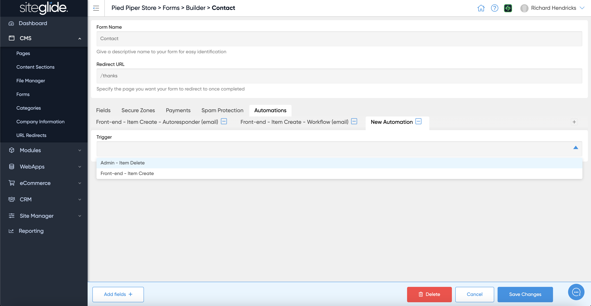
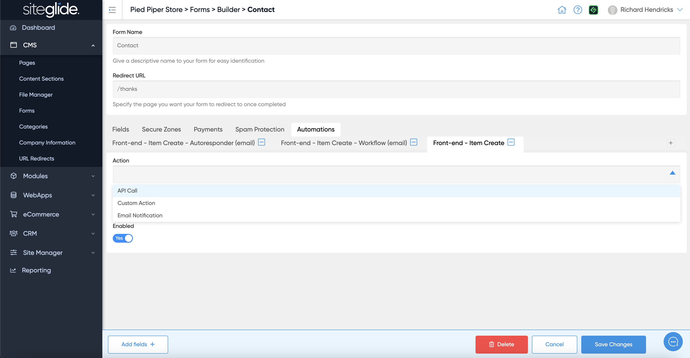

# Automations

## What are Automations?

Automations are a set of Triggers and Actions, which can be applied to Forms, Modules, and WebApps.

For example:

* **Trigger** - When a WebApp item is edited in Admin
* **Action** - Send an email to the content approval team

## What Triggers and Actions are available?

**Triggers**

* Admin item create - Modules (excluding eCommerce Orders), WebApps
* Admin item update - Modules, WebApps
* Admin item delete - Forms, Modules, WebApps
* Front-end item create - Forms, WebApps
* Front-end item update - WebApps
* Front-end item delete - WebApps

**Actions**

* API Call (limited to 1 per trigger)
* Custom (limited to 1 per trigger)
* Email

## How do I add an Automation?

Automations can be added in various places in Siteglide including:

1. Forms
2. WebApps
3. Modules
4. eCommerce

On the Automations tab there's a plus icon (:heavy\_plus\_sign:) on the right hand side, this will then show the Triggers dropdown list:

<figure><figcaption></figcaption></figure>

Once you've selected your Trigger it will show the available Actions and other information or settings available:

<figure><figcaption></figcaption></figure>

In all Automations, you can access the data of an item using both `{{data}}` or `{{form}}` in your code editor.

Once you save your changes, the Automation will then be in place. For example, next time someone creates a WebApp item, your selected Action will be performed.

Note: From this view you can also edit or delete any existing Automations.
