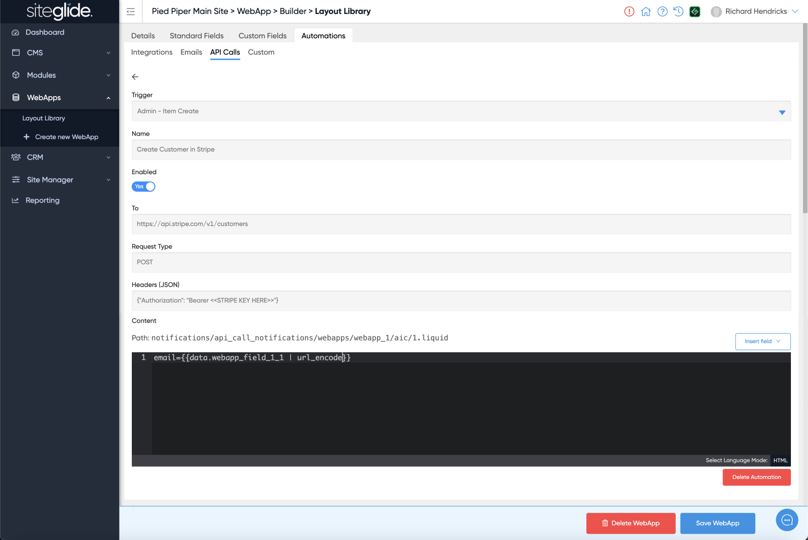

# ℹ️ An API Call Action Example

Once you've read how our [introduction to Automations](../), you're ready to start creating your own. Below is an example of an API call in Automations.

This example will create a customer in Stripe, where the email address is WebApp fief'webapp\_field\_1\_1':\\

<figure><figcaption></figcaption></figure>

