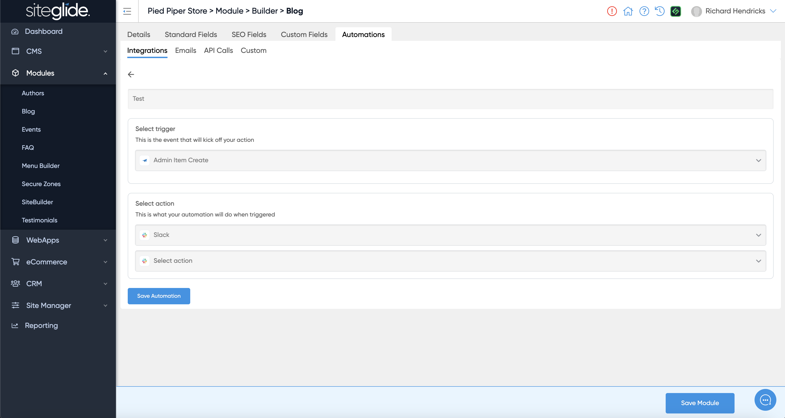
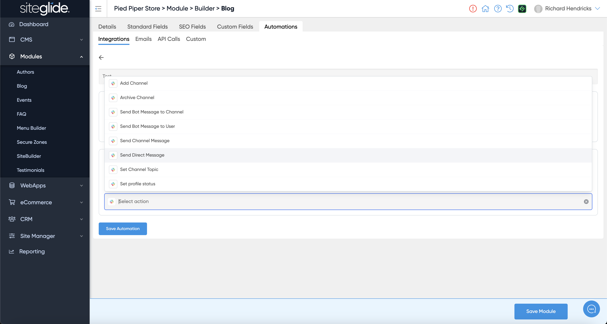
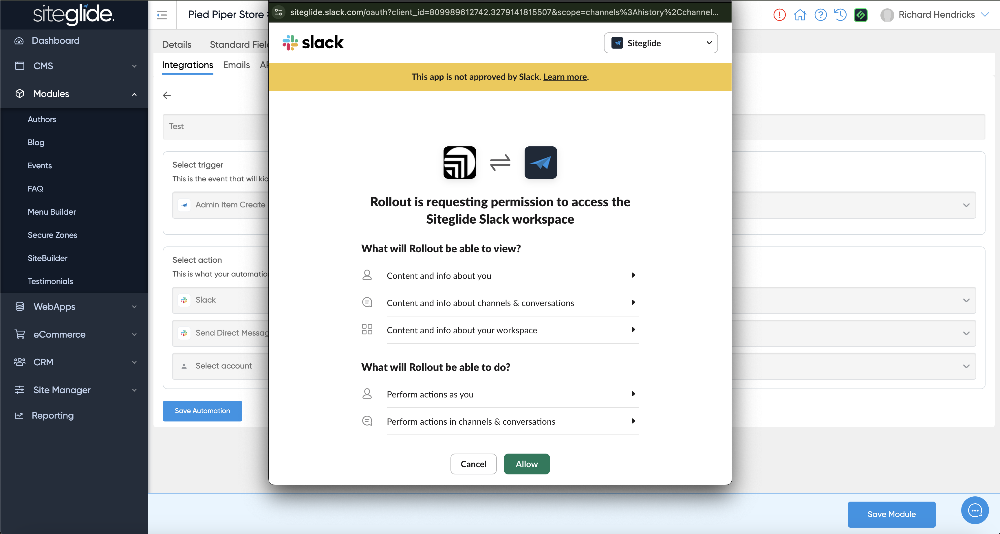
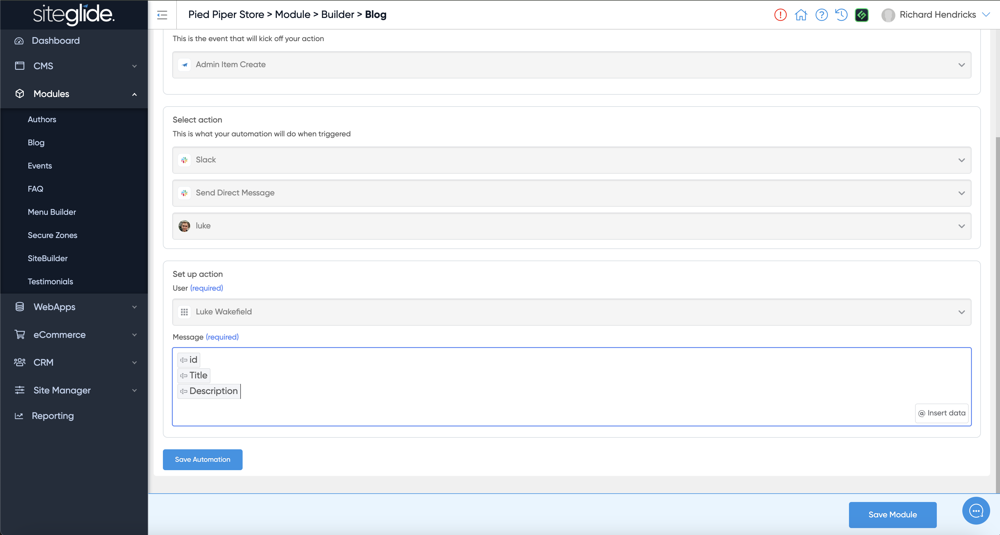

# ℹ️ Integration Automations


While this is now available for all users it is still in Beta and we value any feedback or reports of issues as at 14th October 2024. It's currently free to use but will soon be billed as a usage metric (we expect to merge it with API Calls). We will provide information and warning prior to making it billable.


Integration Automations are a quick and easy way to connect Siteglide with other Apps. They can be added in various places in Siteglide including:

1. Forms
2. WebApps
3. Modules
4. eCommerce

Just look out for the Automations tab (for WebApps and Module click the blue View Table button at the top of the List View of items):

<figure><figcaption></figcaption></figure>

You just need to give the Integration a name and select which Siteglide Trigger you want to use:

<figure><figcaption></figcaption></figure>

Then Select the App you want to connect to for the Action:

<figure><figcaption></figcaption></figure>

Then complete the rest of the steps that are typically unique to that app (Slack is just one example):

<figure><figcaption></figcaption></figure>

Then Connect your Account (SSO/OAuth):

<figure><figcaption></figcaption></figure>

Finally you can customise the Action using Siteglide Data:

<figure><figcaption></figcaption></figure>
