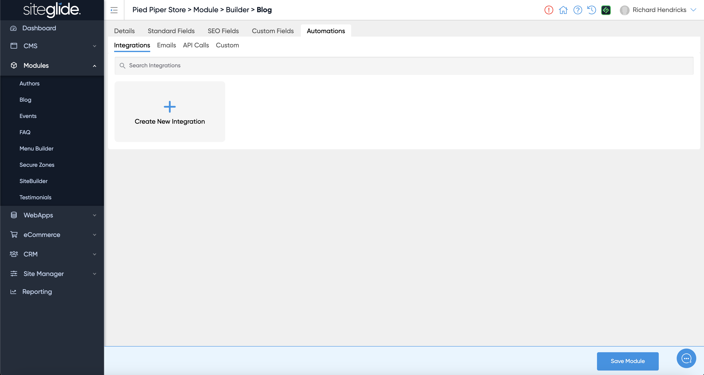
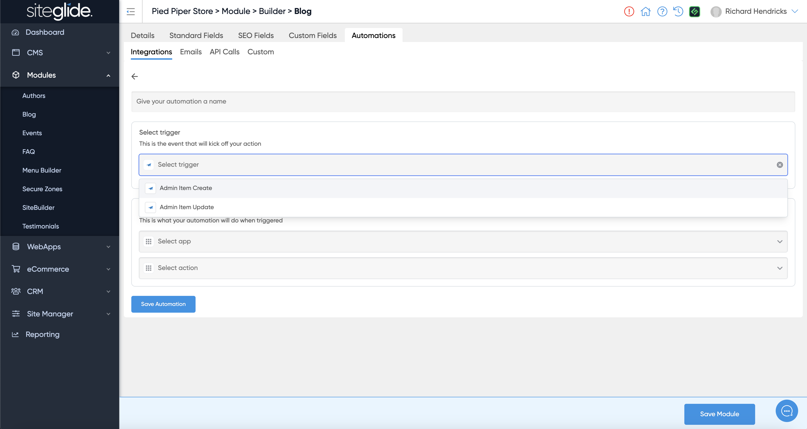
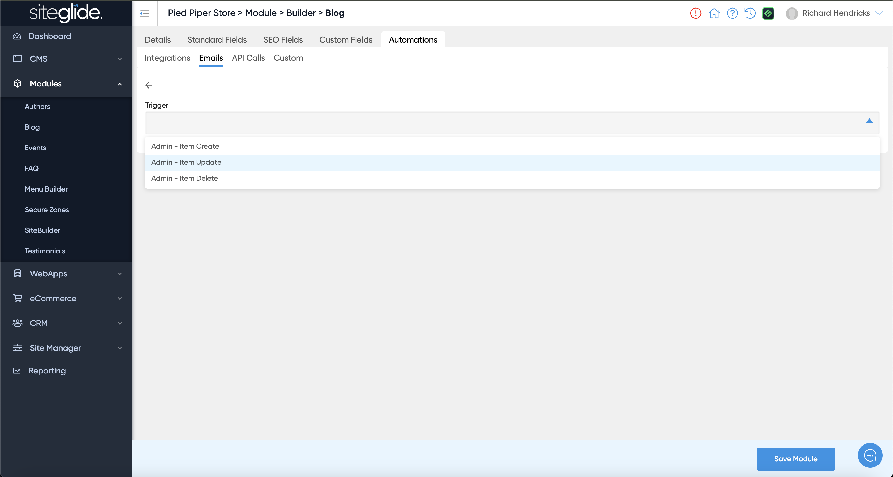
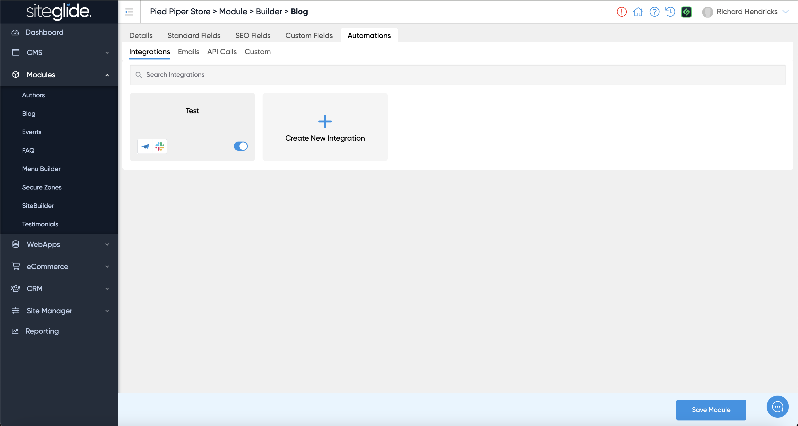
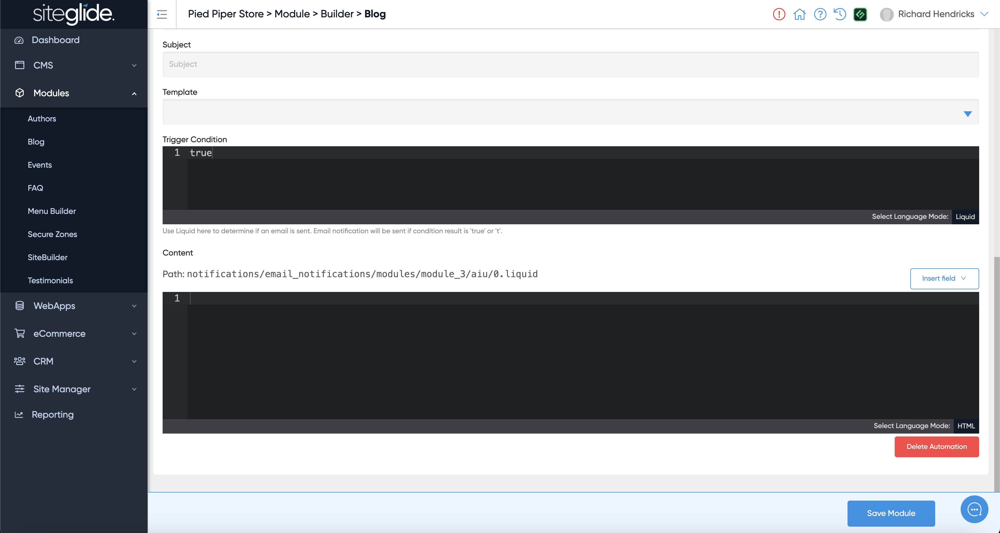

# 🚀 Quickstart: Automations

## Step 1: Where to Add the Automation

Automations can be added in various places in Siteglide including:

1. Forms
2. WebApps
3. Modules
4. eCommerce

Navigate to the relevant feature and look for the Automations tab.

## Step 2: Select an Automation Type:

On the Automations tab there are 4 options, Integrations, Emails, API Calls and Custom:

<figure><figcaption></figcaption></figure>

Find out more about each type of Automation:


[integration-automations.md](guides-automations/integration-automations.md)



[email-automations.md](guides-automations/email-automations.md)



[api-call-automations.md](guides-automations/api-call-automations.md)



[custom-automations.md](guides-automations/custom-automations.md)


## Step 3: Create New Automation & Select a Trigger

### 3a: Integrations

Click the 'Create New Integration' button and then choose a Siteglide Trigger and ensure you give it a name:

<figure><figcaption></figcaption></figure>

### 3b: Emails, API Calls and Custom

For Emails, API Calls and Custom you simply select the Trigger:

<figure><figcaption></figcaption></figure>

## Step 4: Setup and customise your Action

The setup and customisation varies depending on the Action type you use, please follow the relevant setup article:


[integration-automations.md](guides-automations/integration-automations.md)



[email-automations.md](guides-automations/email-automations.md)



[api-call-automations.md](guides-automations/api-call-automations.md)



[custom-automations.md](guides-automations/custom-automations.md)


## Step 5: Managing Automations

### 5a: Customising Automations using Siteglide Data:

In all Automation Types, you can access the data of an item. In Integrations you simply select your data from the dropdown fields and in Emails, API Calls and Custom you can use `{{data}}` or `{{form}}` in your code editor.

### 5b: Enabling and Disabling Automations

You can use the Enable toggle to control whether an Automation is Live. If Enabled it would run the next time that Trigger Event occurs.

<figure><figcaption></figcaption></figure>

### 5b: Deleting Automations

You can delete any automation using the red Delete Automation button that appears at the bottom of the automation itself (within the page, not in the bottom bar):

<figure><figcaption></figcaption></figure>

