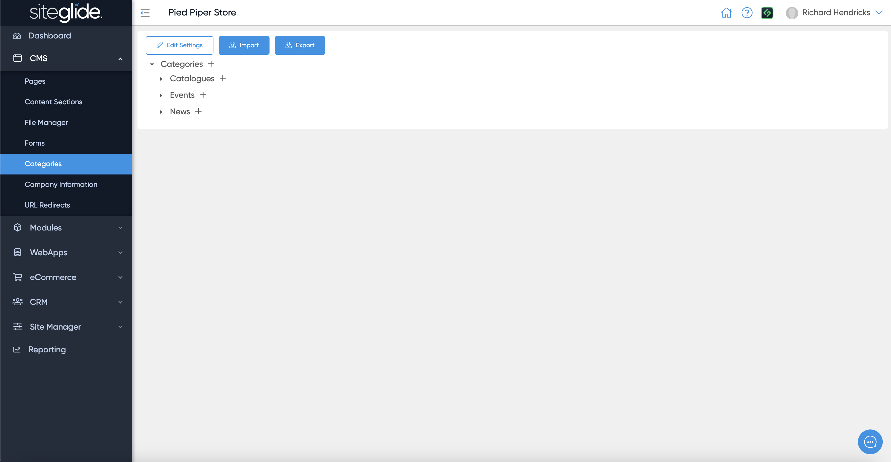
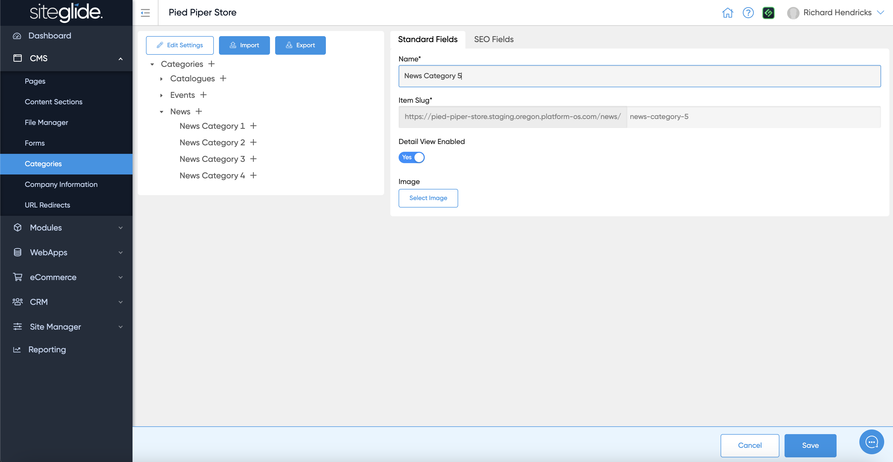
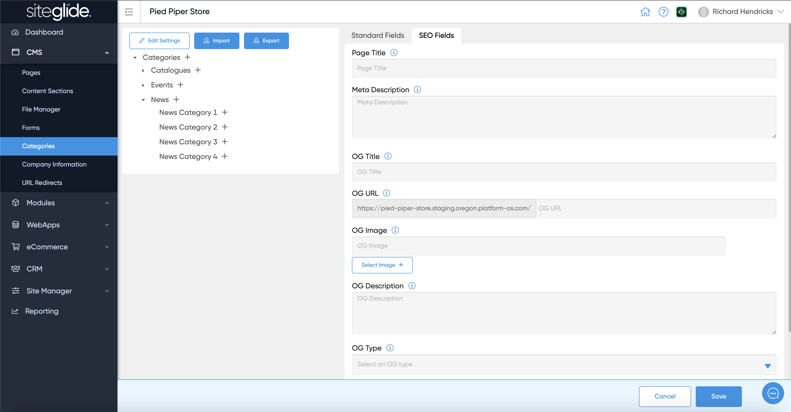
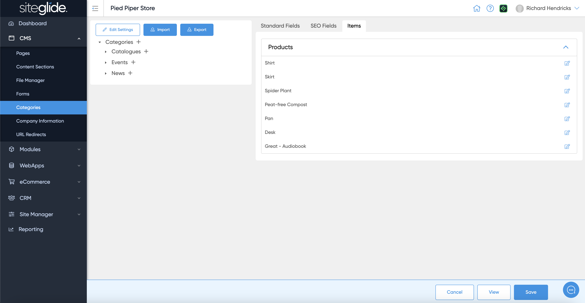

# 🚀 Quickstart: Categories

## Step 1: Find the Parent Category

There are plus (:heavy\_plus\_sign:) icons against each parent and child category so it's important to determine where you want to add a new category and click the plus on the correct parent:

<figure><figcaption></figcaption></figure>

## Step 2: Create New Category

Give it a name, it will create a slug/URL and you can also add an image if required:

<figure><figcaption></figcaption></figure>

## Step 3: Add SEO data if required

The SEO Fields tab let's you add various data to help Search Engines index it correctly but also help Social Media sites display links correctly:

<figure><figcaption></figcaption></figure>

## Step 4: Manage Items

On an existing category you might see items that are already assigned to it, this is a helpful way to get directly to an item in a specific category:

<figure><figcaption></figcaption></figure>

## Step 5: Manage the Template and Layout

You might want to assign a Detail Page Template and Detail Layout to Categories if users are able to navigate through the file structure (useful for eCommerce etc):

<figure><figcaption></figcaption></figure>
