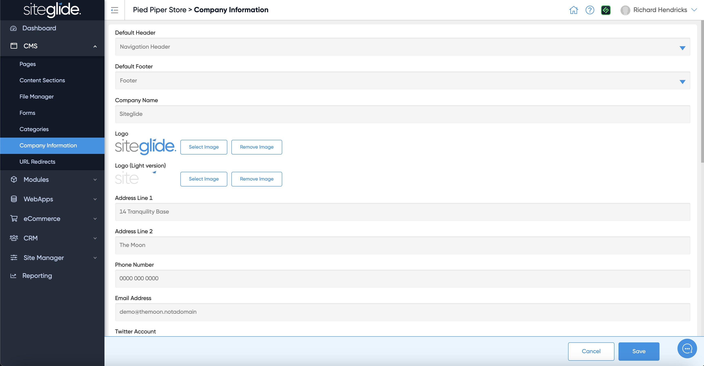

# ℹ️ About

Company Information is a simple feature that stores the most used business information so it can easily be used across the site dynamically.

You can just fill in the fields you want to use:

<figure><figcaption></figcaption></figure>

To output a field on the page you just need the corresponding Liquid tag:


[company-information.md](company-information.md)

