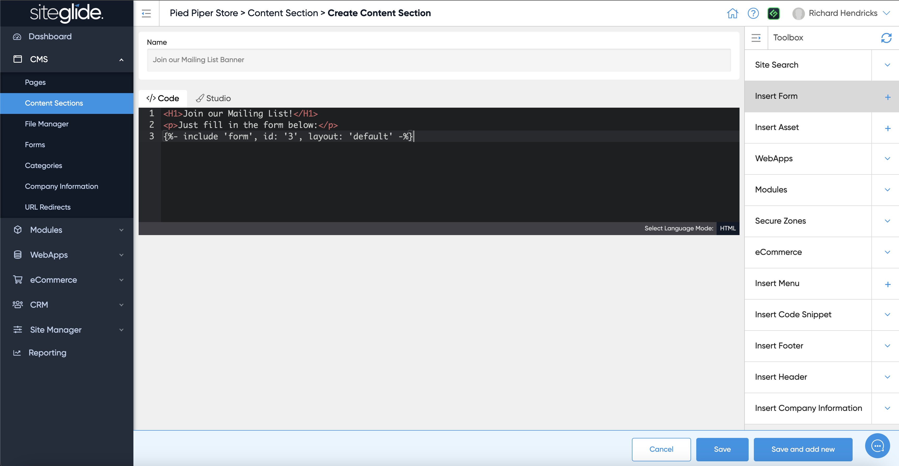
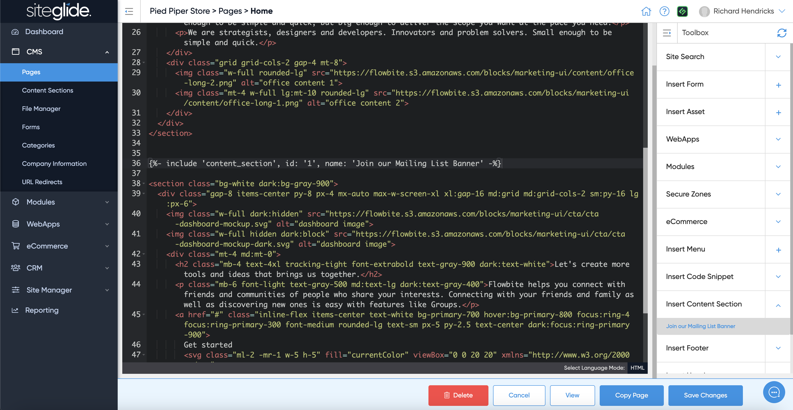

# Content Sections

Content Sections are reusable snippets of code (Liquid Partials). They're useful if you know you need to have the same content on multiple pages and want to be able to edit it once and the changes reflected everywhere:

<figure><figcaption></figcaption></figure>

You can then easily insert the Content Section into any page using CLI or via Toolbox ([code-view-and-toolbox.md](pages/code-view-and-toolbox.md "mention")):

<figure><figcaption></figcaption></figure>
