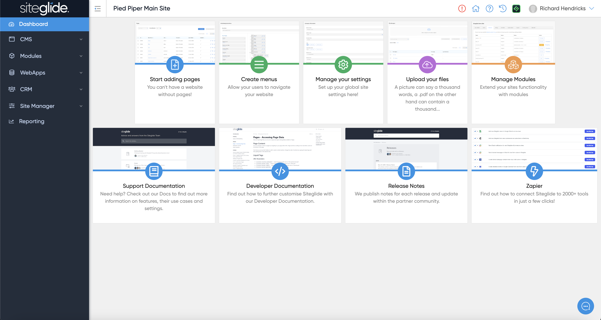

# Dashboard

This is the page you land on when you click the Admin button from Portal:

<figure><figcaption></figcaption></figure>

It's simply a Landing Page to help you find the most commonly used areas of the CMS.

If you're new to Siteglide please make sure you start with one of our Site Templates so you can see Siteglide in action:


[create-site-from-template.md](../sitebuilder/setup-sitebuilder/create-site-from-template.md)


We'd then recommend getting familiar with the following sections:


[pages](pages/)



[file-manager](file-manager/)



[menubuilder.md](../modules2/menubuilder.md)



[forms](forms/)



[categories](categories/)

