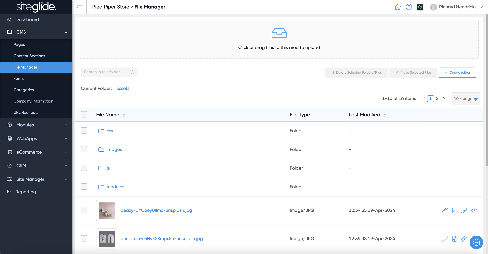
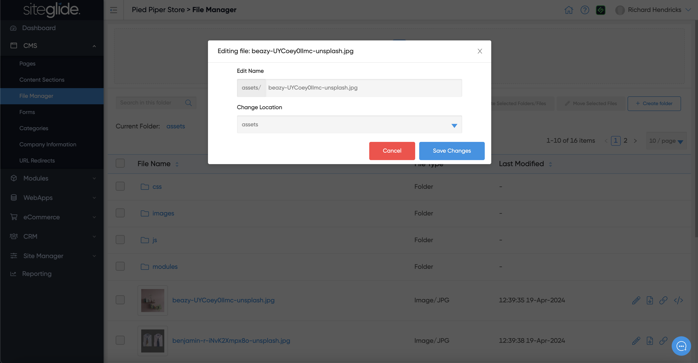

# File Manager

Siteglide has a built-in Document Management System (DMS) where you can create folders and upload various types of files (assets) including Images (JPG, PNG, SVG, WEBP etc), PDFs and Videos:

<figure><figcaption></figcaption></figure>

The first button on the right of each image allows you to Edit the image:

<figure><figcaption></figcaption></figure>

The second button is to Download the image. The final 2 buttons are to copy the URL for the image:

1. Direct URL: The full CDN URL you can use in background images or external links.
2. Asset URL: The dynamic version that should be used on Siteglide pages for optimum performance.

