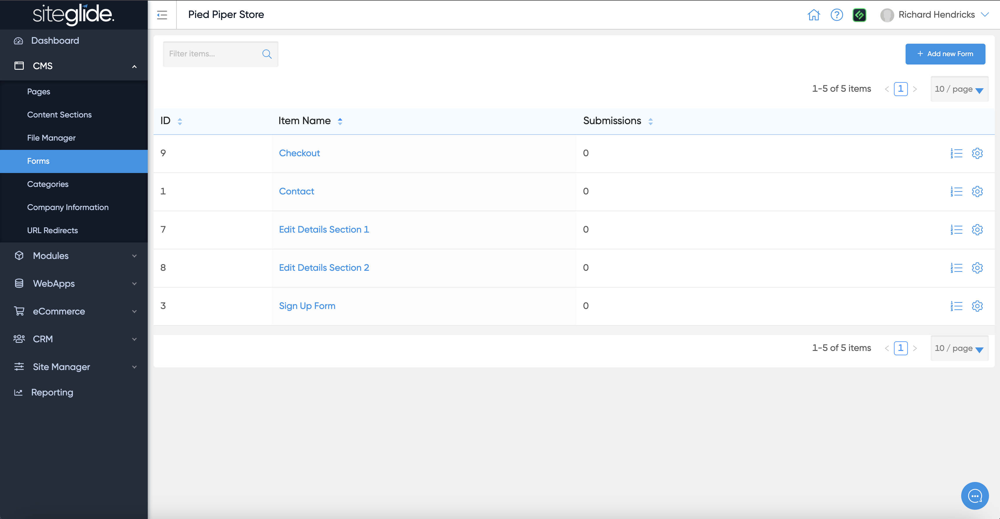
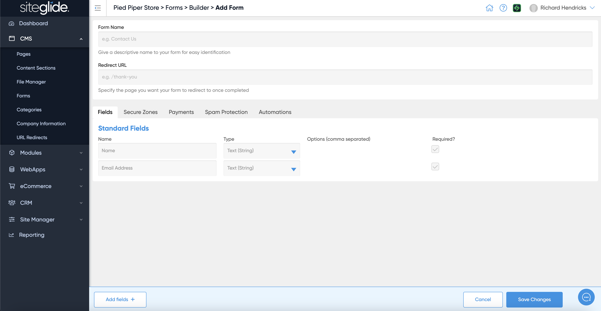
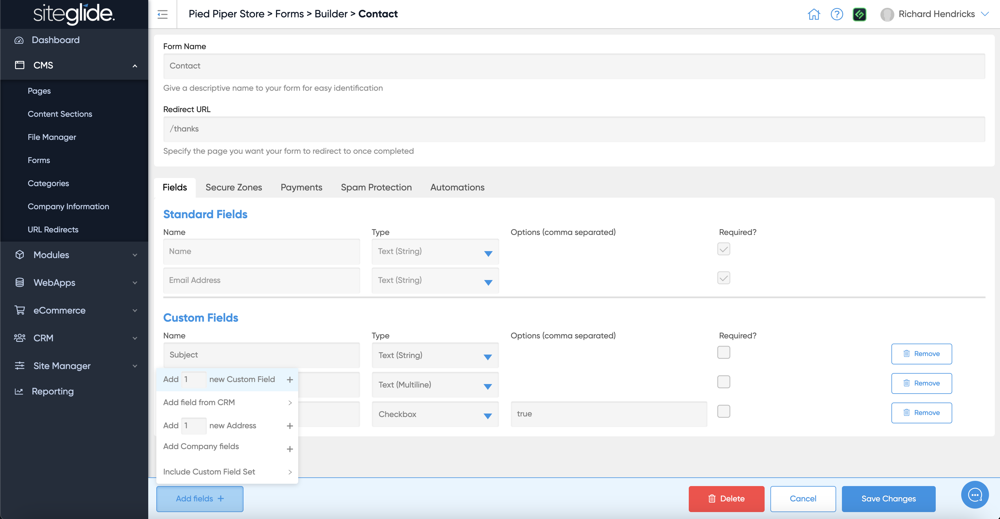
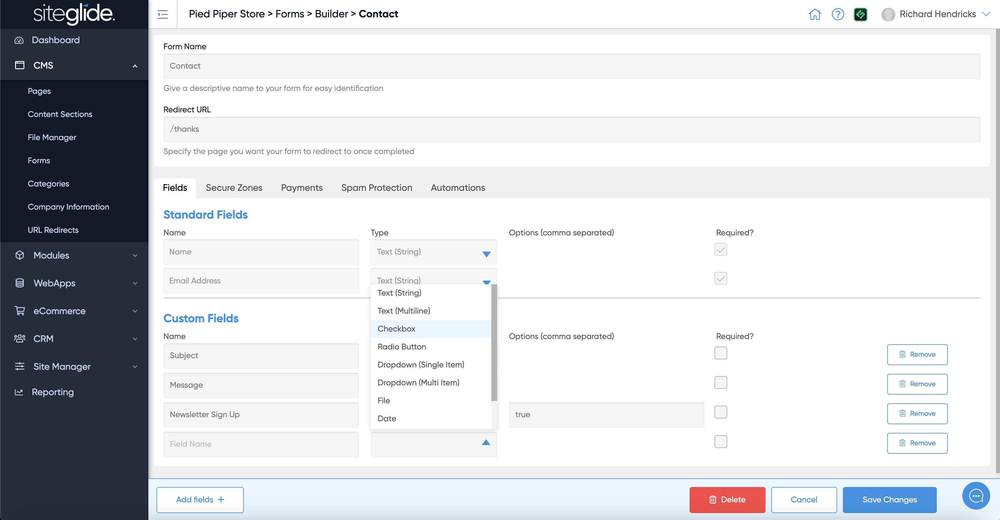
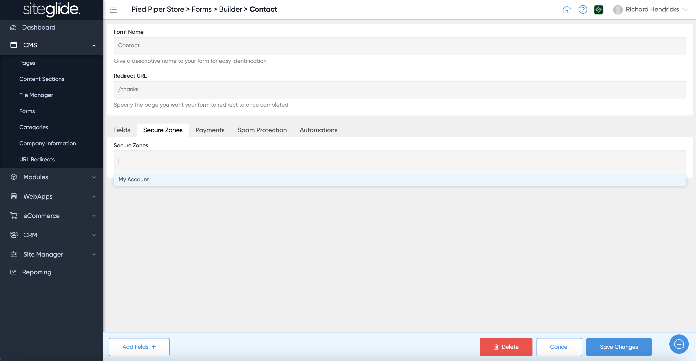
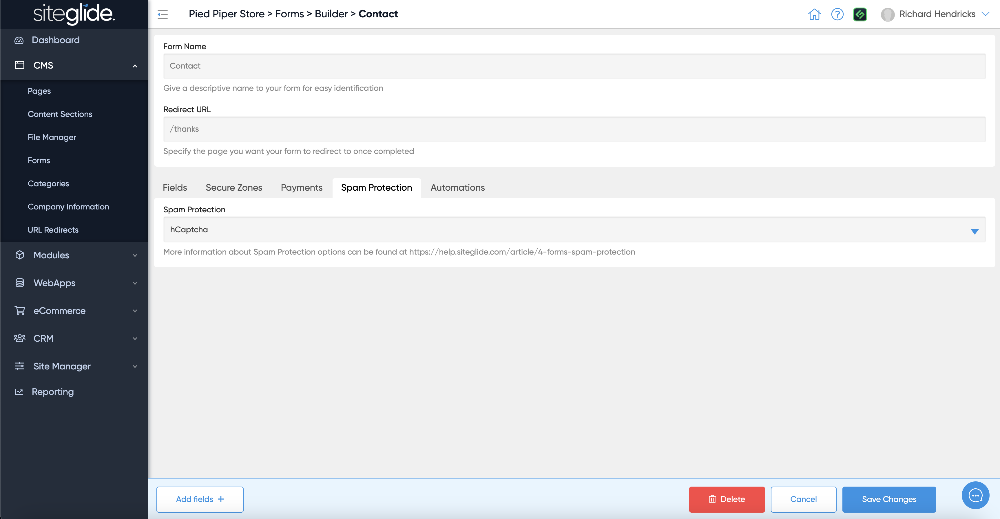
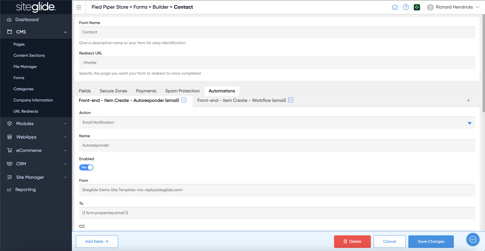

# Quickstart: Forms

You can find forms under CMS in the main menu. You can edit an existing form or create a new one:

<figure><figcaption></figcaption></figure>

## Step 1: Create a Form

Give the form a Name and choose what page you want visitors to be sent to once they submit. There are also tabs to control the other form features and settings:

<figure><figcaption></figcaption></figure>

## Step 2: Edit the Fields

You will also see the standard fields included and and add fields button in the bottom left:

<figure><figcaption></figcaption></figure>

You can choose and edit the field type from the dropdown:

<figure><figcaption></figcaption></figure>

## Step 3: Add features (optional)

You can control whether the form adds the person who submits the form to a Secure Zone:

<figure><figcaption></figcaption></figure>

You can also take payments via a Form:

<figure><figcaption></figcaption></figure>

## Step 4: Spam Protection

We strongly recommend using hCaptcha to protect you forms from spam as this runs server-side but you can also use reCaptcha if needed:

<figure><figcaption></figcaption></figure>

## Step 5: Automations

Automations are a very powerful feature that allow you to send emails such as Workflows and Autoresponders, run logic and other functions including API calls to external services:

<figure><figcaption></figcaption></figure>

More information on Automations:


[automations](../automations/)


## Step 6: Form Layouts

You have total control over how the form looks by editing the Layouts. If you use SiteBuilder these layouts can dynamically update when you edit the form fields:


[static-and-dynamic-form-layouts.md](../../sitebuilder/setup-sitebuilder/layouts/about-layouts/static-and-dynamic-form-layouts.md)


