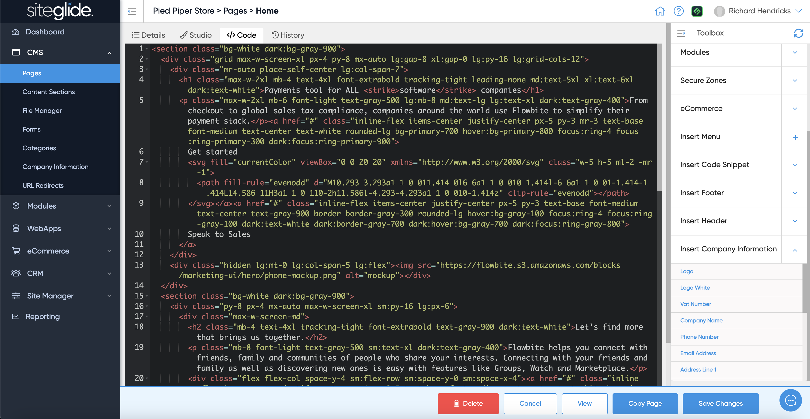
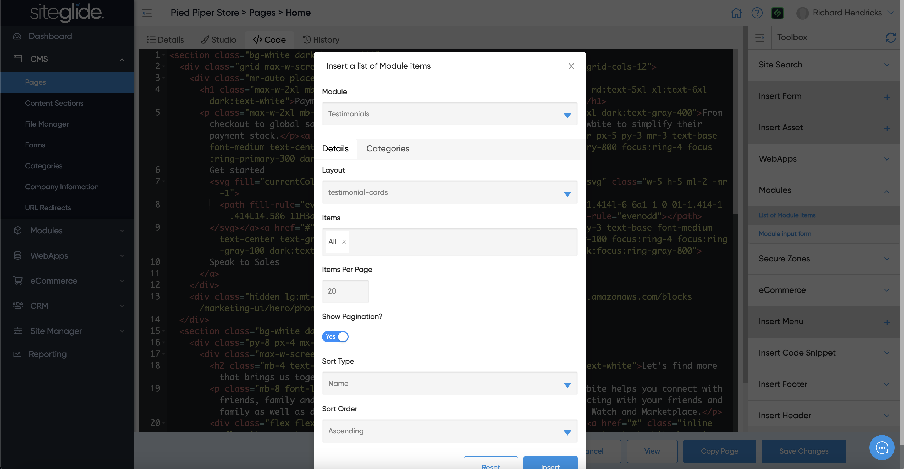

# ℹ️ Code View & Toolbox

The Code View is an easy way to quickly edit the page via code. You can switch between Studio and Code view without needing to save changes.


We recommend using the CLI for most code related work: [cli](../../developer-tools/cli/ "mention")


The most powerful feature of Code View is the Toolbox area on the right hand side. This dynamically updates depending on what you have installed on the site and what items you've created.

You can use Toolbox to insert static content such as Images (Assets), Code Snippets, Company Information:

<figure><figcaption></figcaption></figure>

Where Toolbox becomes even more powerful is it will help you craft dynamic tags (Liquid Includes) to insert dynamic content such as Forms, Module List Views and much more:

<figure><figcaption></figcaption></figure>
