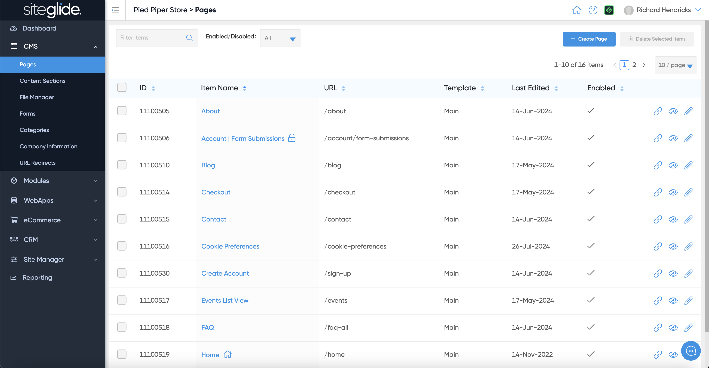
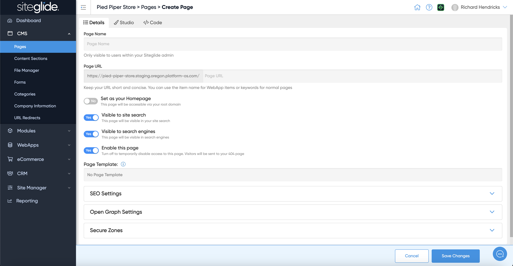

# 🚀 Quickstart: Pages

## Step 1: Create a Page


You can also create pages via [cli](../../developer-tools/cli/ "mention") and with [pagebuilder.md](../../sitebuilder/setup-sitebuilder/pagebuilder.md "mention") (part of SiteBuilder)


To create a blank page go to CMS > Pages and click Create Page:

<figure><figcaption></figcaption></figure>

## Step 2: Page Details

Give the page a Name, it will create a URL which has to be unique (edit the Name/URL until unique):

<figure><figcaption></figcaption></figure>

You likely need to assign a Page Template, if none appear in the dropdown you'll need to create one:


[templates.md](../../site-manager2/templates.md)



Our SiteBuilder Templates come with Page Templates and are the easiest way to get started with Siteglide: [quickstart-sitebuilder.md](../../sitebuilder/setup-sitebuilder/quickstart-sitebuilder.md "mention")


There are various other settings including SEO meta data, Open Graph and assigning the page to a Secure Zone.

## Step 3: Add Content

You have 3 ways to add content and build out pages:

1. **Studio:** Our visual no-code editor allows you to edit content and, depending on the setup, insert new Layouts (e.g if SiteBuilder is installed).
2. **Code Editor:** The 'code' tab allows you to write code from within Siteglide and also includes the powerful Toolbox area on the right hand side to insert content. Find out more about: [toolbox.md](toolbox.md "mention").
3.

