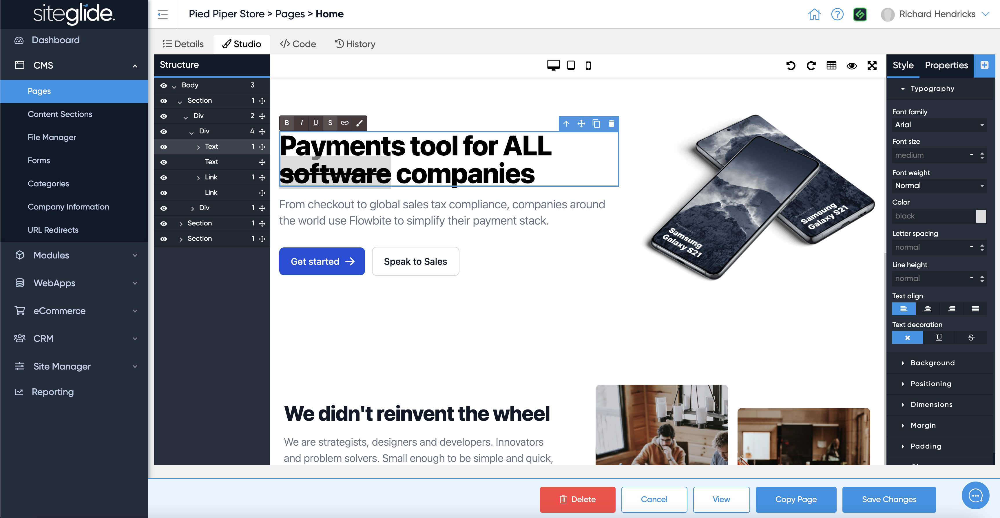
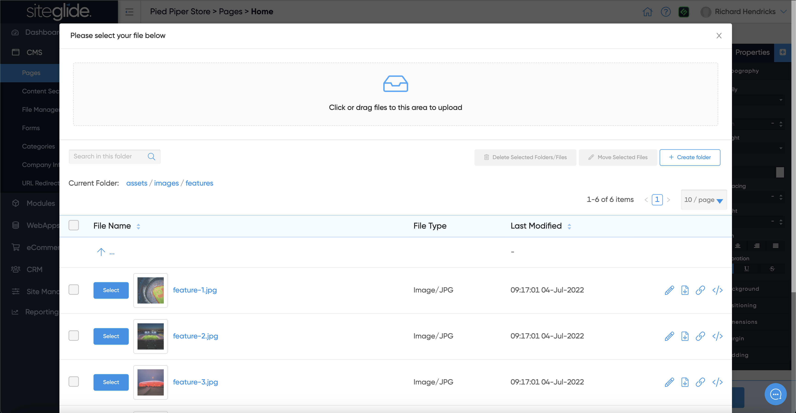
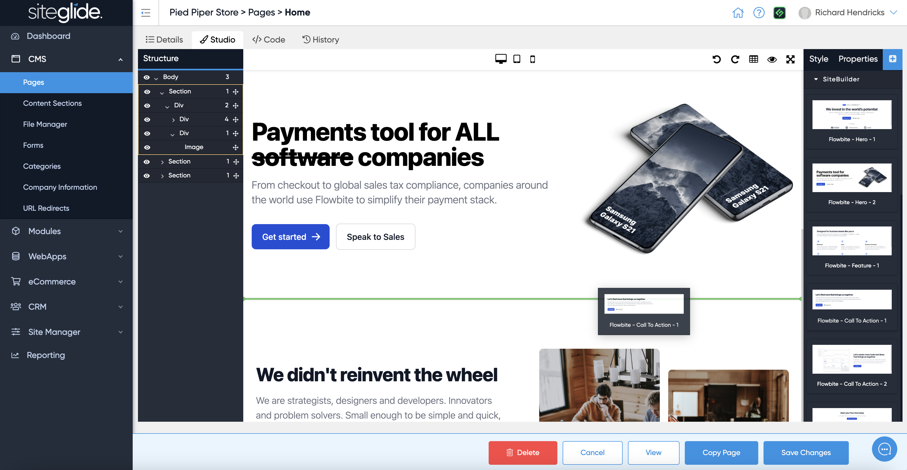

# Studio

Studio is our no-code editor that also allows you build out pages if you have Layouts installed (e.g. [Broken link](broken-reference "mention"))

You can easily edit existing content by clicking text and using the Rich Text Editor tools as well as the 'Style' tab on the right hand side. The Structure tab on the left helps you move sections around if needed:

<figure><figcaption></figcaption></figure>

If you double click an image it will open the File Manager modal where you can upload new images or browser already uploaded images to insert:

<figure><figcaption></figcaption></figure>

You might also want to add new sections and content to your page, if you click the blue plus icon (:heavy\_plus\_sign:) on the right hand side you will be able to insert basic components and if you have SiteBuilder installed you will see the full list of Static Layouts available:

<figure><figcaption></figcaption></figure>
