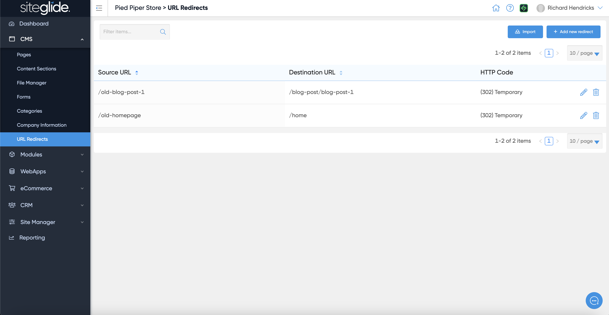
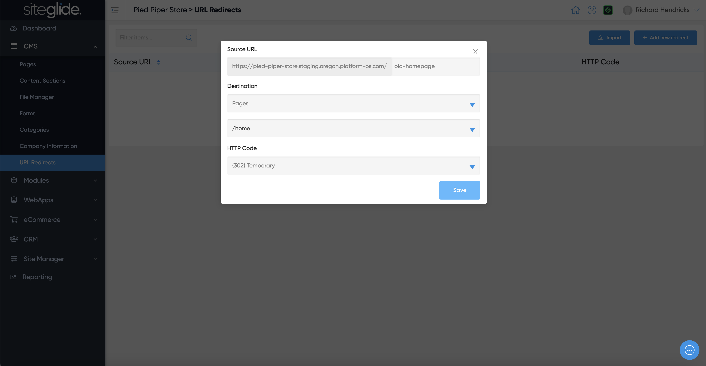
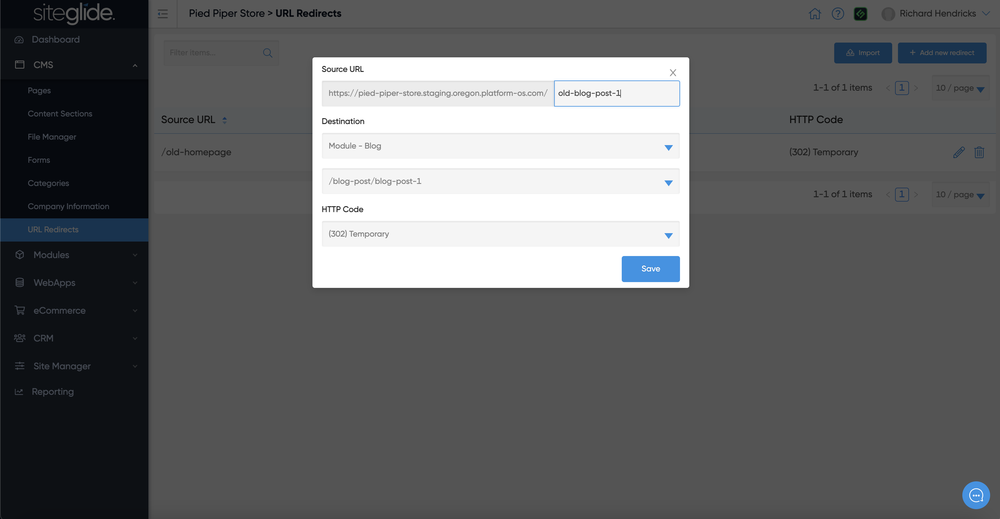

# URL Redirects

URL Redirects, as the name suggests, allow you to redirect one URL to another. It's extremely useful when building a new version of a Page or Website.&#x20;

You simply type in the Source URL (Old URL) and then choose the Destination URL (New URL) and whether you would like it to be seen as temporary (302) or permanent (301) by Google. Once saved it will show in the list:

<figure><figcaption></figcaption></figure>

You can redirect pages by typing in the old URL and then selecting the page from the dropdown:

<figure><figcaption></figcaption></figure>

You can also redirect pages by typing in the old URL and then selecting the page from the dropdown:

<figure><figcaption></figcaption></figure>
