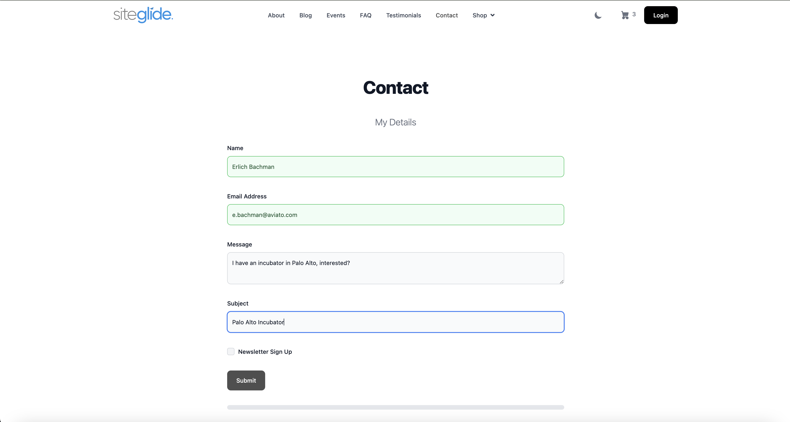
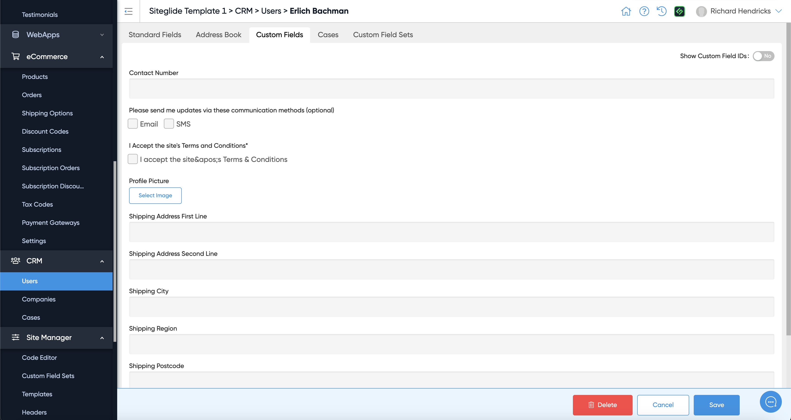
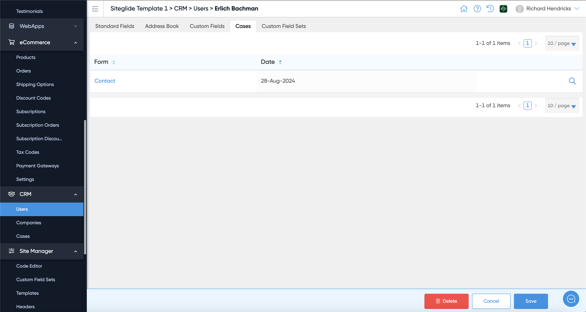
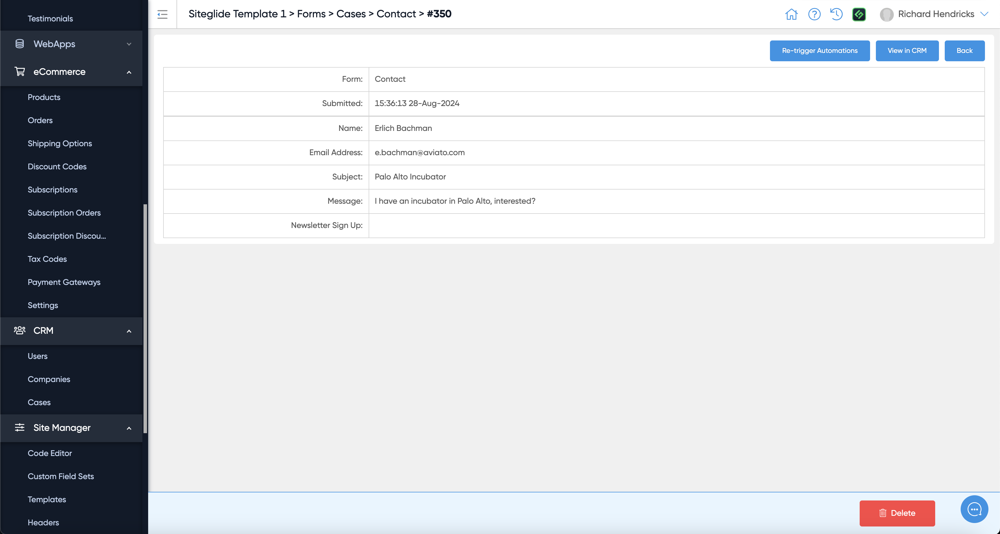
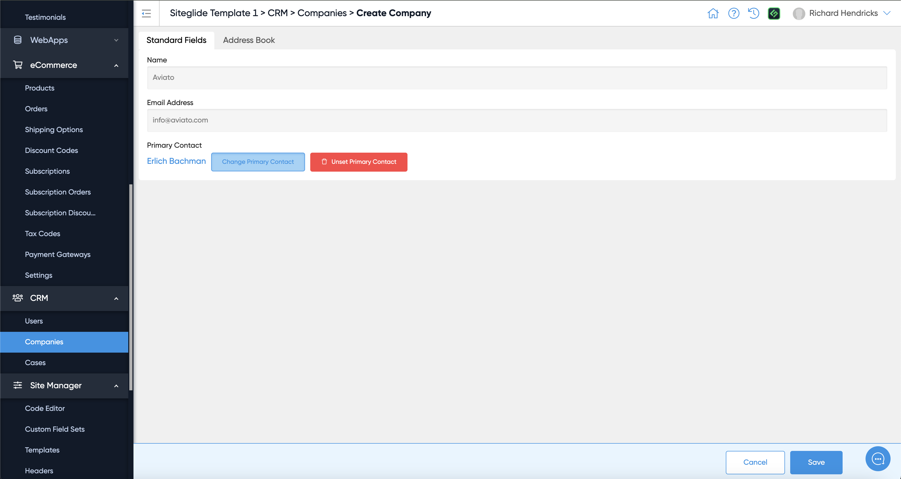
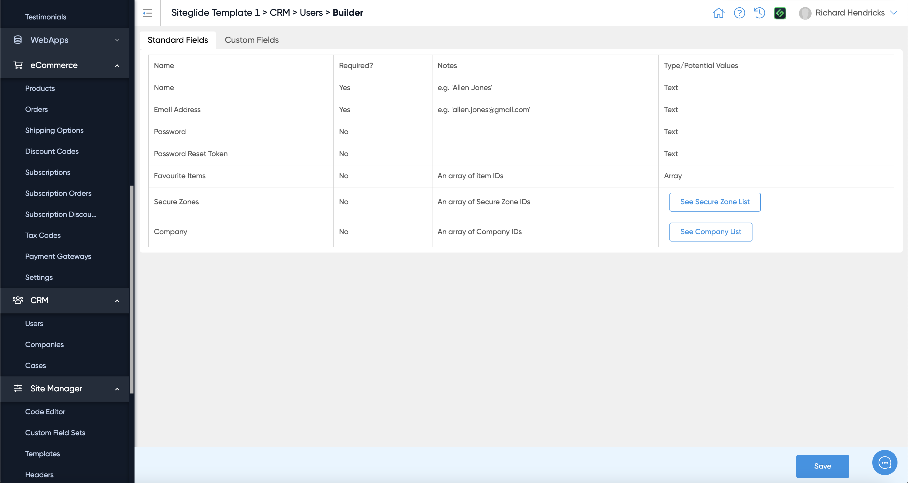
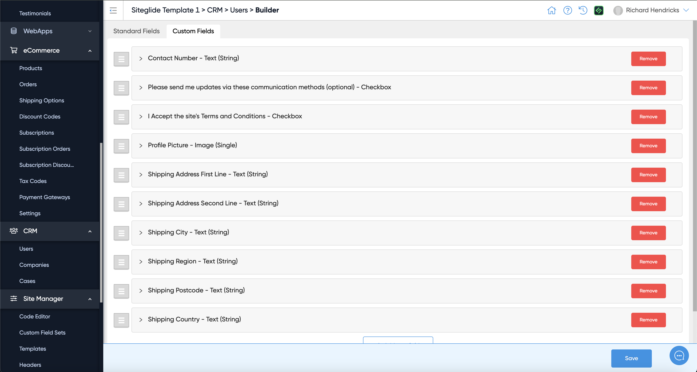

# 🚀 Quickstart: CRM

This Quickstart is a guided tour of the CRM feature within Siteglide. There is no setup required, it works out of the box but can be customised.

Whenever a form is filled in on the website or other actions are taken the CRM can be automatically updated:

<figure><figcaption></figcaption></figure>

## CRM Users

The CRM itself now has a new user:

<figure><figcaption></figcaption></figure>

There are Standard Fields associated with the User:

<figure><figcaption></figcaption></figure>

You can also manage Addresses:

<figure><figcaption></figcaption></figure>

As well as any custom information stored in Custom Fields:

<figure><figcaption></figcaption></figure>

## Cases (Form Submissions)

Cases are typically Form Submissions:

<figure><figcaption></figcaption></figure>

This Case shows the form submission we made at the beginning of the article:

<figure><figcaption></figcaption></figure>

## Companies

You can also create Companies and link a Primary Contact to it:

<figure><figcaption></figcaption></figure>

Just search for the User you'd like to make the Primary Contact:

<figure><figcaption></figcaption></figure>

## Customise the CRM

The Table Builder shows the Standard Fields information:

<figure><figcaption></figcaption></figure>

You can add and remove Custom Fields in the Table Builder:

<figure><figcaption></figcaption></figure>

