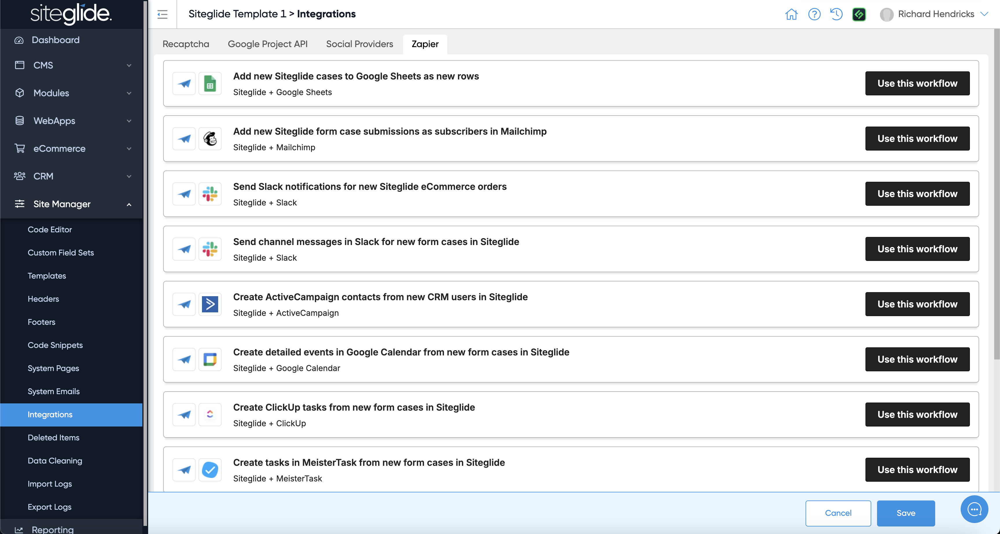

# Zapier Integration

Our Zapier Integration is easy to use straight out of the box and there are workflows setup that you can use:

<figure><figcaption></figcaption></figure>

## Formatting Arrays


[formatting-arrays-correctly.md](formatting-arrays-correctly.md)

