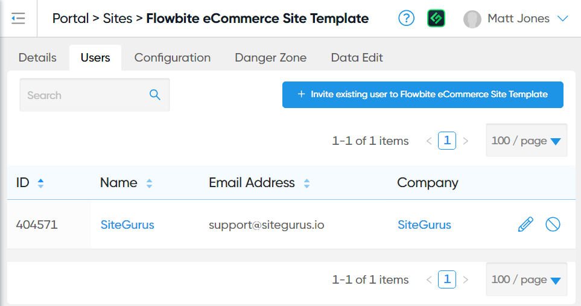

# 📋 Steps to Datasource and Display Related Products

How to use Module Custom Fields to output similar, related products

## Pre-requisites

* Your [eCommerce Module](https://help.siteglide.com/article/200-getting-started-with-siteglide-ecommerce) is updated to at least version 1.2.0
* You have already [created eCommerce Products](https://help.siteglide.com/article/196-products-introduction) and outputted them in List or Detail Layouts on the Site

## Introduction

Module Custom Fields allow a wide range of use cases for connecting up different areas of your Site. In this Article we'll look at how you can create a new Custom Field for your eCommerce products to store similar, related Products which could be displayed on the Product's Detail Page.

You could of course use this same technique with the Blog Module or any other Module or WebApp.

### Step 1) Add a new Custom Field to Products

To add a Custom Field to Products, first select Edit Module Structure from the Products List in Admin.

<figure><figcaption></figcaption></figure>

At the bottom of the available fields, you can find the Custom Fields section, and press the "Add new field" button.

The name of your field can be whatever you want, here we'll call it Related Products. The Datasource Multi type prompts us to choose a Module or WebApp that we will be able to select Items from.

<figure><figcaption></figcaption></figure>

When you're ready, press save and your new Custom Field will be set up. You'll then be able to use this field when creating and editing Products.

### Step 2) Add related Products to a Product

In this example, we'll edit the new Custom Field on an existing Product to create a relationship with another Product. From the Product Edit Page, select the Custom Fields tab:

As we used the Datasource Multi field type and selected Products as the Module to be linked to, Siteglide knows what we're trying to do and will help us find the related Items.&#x20;

<figure><figcaption></figcaption></figure>

Select as many as you need. Each Product's unique ID will be stored in array format in your Custom Field.

When you're ready, save the Product.

### Step 3) From the Product Detail Layout access the Related Product IDs

For the next steps (3 - 6), we'll be navigating to Code Editor to develop custom Layouts to display the Related Products Front End. We'll start by working in the "item.liquid" file of the Layout you're using for the Product Detail View. We'll nest a new List of Related Products inside this Detail Layout.

Inside the item.liquid file, we can access the Custom Field by name:

```liquid
<h2>Related Products</h2><br><br>
{{this['Related products']}}<br><br>
```


It is sometimes more reliable to access a field by its ID, in case the name is changed in future. E.g. `{{this.properties.module_field_custom_14/product_1}}`


This outputs an array of the IDs of each of the related Products stored against our current Product. It should look something like this: `["55","75","147"]`

### Step 4) Convert the Related Product IDs to a comma-separated String format

In Step 5, we'll need to nest a new List Layout of Products inside the Detail Layout and filter this by the IDs of our Related Products. However, the IDs are currently in an Array format and the `include` Liquid tag's `item_ids` parameter expects a comma separated String.

We can change the type by assigning a new variable:

```



```

### Step 5) Add a Product List Layout which Datasources to the Related Products

Next, we need to output a Product List, nested within our existing Product Detail Layout.

<pre class="language-liquid"><code class="lang-liquid">&#x3C;h2>Related Products&#x3C;/h2>
<strong>
</strong> 

</code></pre>

_**Item Ids Parameter**_&#x20;

Without the `item_ids` parameter, our List outputs only the first few Products alphabetically, instead of fetching our dynamic Related Products.

We can change that by adding the `item_ids` parameter and feeding in our comma-separated String of IDs (that we stored in a new Liquid variable):`item_ids: related_products`

_**Datasource Parameter**_&#x20;

`datasource: 'true'` When you output an include inside a Detail Layout, by default Siteglide will try to fetch a Detail Layout. This is one reason why it's important to set the `datasource: 'true'` parameter, which will then cause Siteglide to look for a List type Layout.

Another benefit of the `datasource: 'true'` parameter is that if no Related Product IDs are available, the List will return empty, instead of returning an unfiltered List. This prevents the List from showing unrelated Products in this situation.

_**Per Page Parameter**_

`per_page: '3'` In the example, the per\_page has been set to 3. In some cases, you may wish to limit the number of "related" results in this way, so they don't distract from the main subject of the Page. It is completely optional.

_**Layout Parameter**_ \
\
Select the name of a Product List Layout you'll use to style how the dynamic Related Products List will look (see Step 7).

### Step 6) Hide content when no Related Products exist

Optionally, you can add Liquid logic to only display the subtitle and Related Products content when the field is not empty. As the field contains an array, a safe way to check if it holds a value is to check its size (Liquid for the length of the array).

```liquid


  <h2>Related Products</h2>
  
   


```

### Step 7) Optional - Develop a Custom Layout for the Related Products

You can style and write Liquid for the Related Products List Layout in the same way you do for any [Product List](product-lists.md). For example, you could provide a link to the Detail Pages of those Related Products using the Slug property.

You've now completed the Step by Step guide for adding Related Products.
