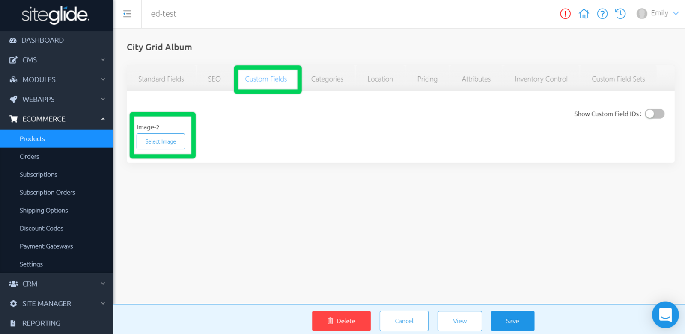

# Product Custom Field Sets

Custom Field Sets are groups of Custom Fields that you can reuse across a range of Siteglide Records including Users, and Products. Head to Site Manager > Custom Field Sets in the left-hand side Menu, to start using.

## Where can you add Custom Field Sets to your Products?

Once your Custom Field Set has been created, you can assign it to an individual Product. From Standard Fields, navigate to the Custom Field Sets tab. Choose a Custom Field Set that you have created in the drop-down and click Save.

Any Custom Field Sets you have added within the Product will appear as tabs within Custom Field Sets.

You can press the "+" icon at the end of the row to add a new Custom Field Set to this Product. The fields you added previously can now be filled in with Product-specific information.
