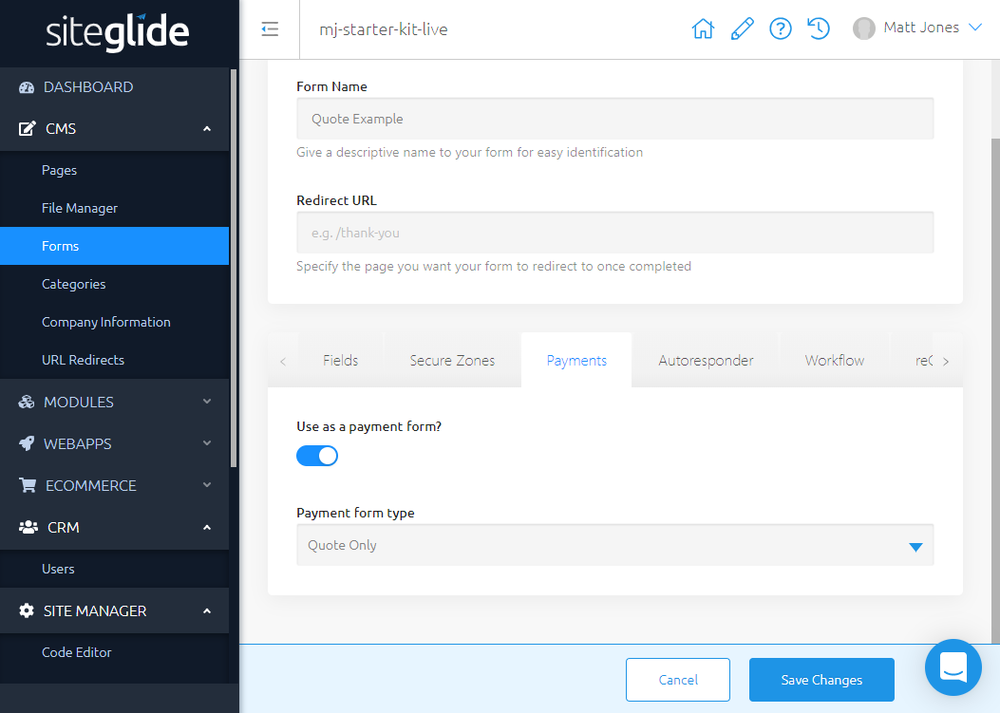
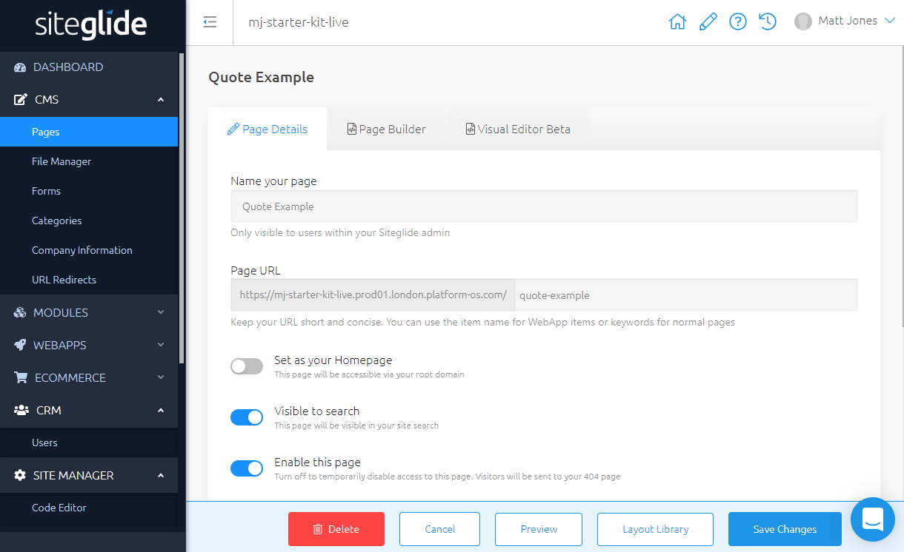
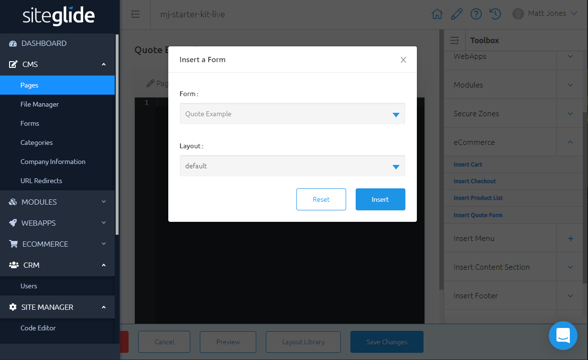
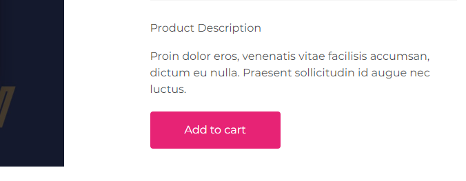
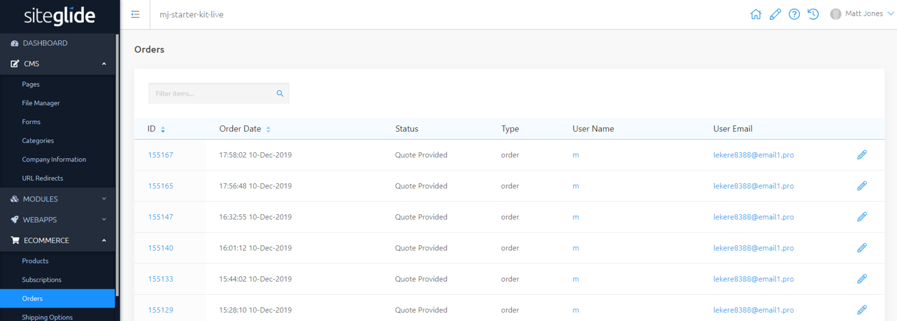
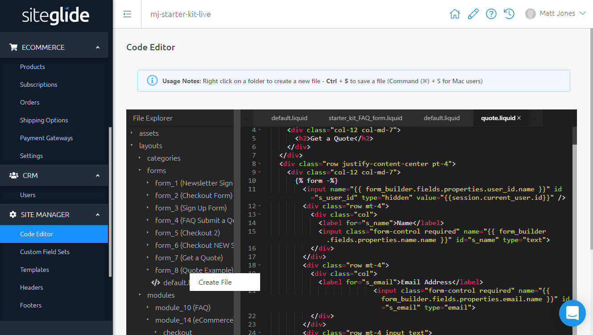

# Quotes

## Prerequisites

For existing Sites, make sure you have updated to the latest version of the eCommerce Module in Portal. For new Sites, you'll need to install the eCommerce Module.

Create some eCommerce Products Set up Product Detail Pages and a Shopping Cart. Try the How to Set Up a Shopping Cart and Guest Checkout Tutorial to learn more about setting this up. To learn more about customising the layouts, visit the following for Product Detail Layouts, Cart Layouts, Liquid reference.

## Introduction

Some companies prefer to give Quotes and generate Leads rather than asking Customers to pay for Products immediately as they order.

A customer generates a quote by:

* Adding Products to their Cart
* Submitting a Quote Only form

A Client will see the following:

* User Submissions are saved in the CRM.
* In the CRM the User will have an order with the status: "Quote Only". This will contain all the Products that were in their Cart when they submitted the Form.

You can develop this further with:

* Custom Fields and Custom Field Sets allow you to add additional fields to the Form.
* Fully-customisable Layouts would allow you to style the - Product Detail Page and Cart differently e.g. hiding Prices, should your project require it.

\#Tutorial

### Step 1: Create a Form

In the Payments Tab, toggle on "Use as a payment form" and select "Quote Only" from the dropdown.



### Step 2 - Use Toolbox to insert this Form on a Page

First, create your Page or select a Page you've created earlier.



Next, in the Page Builder tab, use Toolbox on the right-hand side to enter the Form. You can find it under eCommerce/Insert Quote Form.



The code should look something like this:

```liquid




```

... where the form\_id matches your Form's ID.

### Step 4 - ...and you're set up. Time to try it out!

Add items to your Cart



Navigate to your Page and Submit the Form



Inspect the Order in Admin



Any Orders produced in this process will have the status: "Quote Provided" in Admin. You can click on any email in the "User Email" column to find the CRM entry for the User who submitted this Order.

Note - Generating a Quote in this way will not remove stock from Products' Inventories. However, Products cannot be added to the Basket if they are out of stock.

## Customising Layouts

With customisation, you can make further changes to the Layouts including hiding prices from Product Detail Page and Cart.

For the default Layout, the following Liquid will be taken care of for you, but when building a custom Layout you must make sure it is still included on the line before the submit button:

```liquid



```

In the Examples above we started with a Starter Site and copied the code from the default Form Layout into a new Layout, editing the appearance of the Button.
