# 🚀 Quickstart: eCommerce


This Quickstart guide covers the basics of setting up an eCommerce store using SiteBuilder. To build your layouts from scratch (not using SiteBuilder) you would just create your own Layouts either in Code Editor or via CLI.


We strongly recommend starting from the template if you're not familiar with Siteglide or the eCommerce module in particular:


[create-site-from-template.md](../sitebuilder/setup-sitebuilder/create-site-from-template.md)


Most of these steps will be already done for you if you use the Template, you can simply customise each section to suit your store.

## Step 1: Install the eCommerce Module

Ensure the eCommerce Module is installed:

<figure>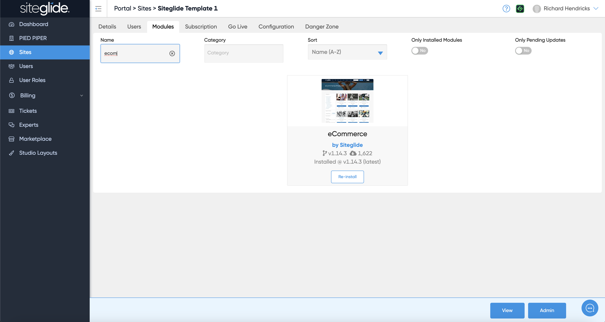<figcaption></figcaption></figure>

For more help managing Modules follow the dedicated guide:


[install-and-manage-modules.md](../portal/sites/install-and-manage-modules.md)


## Step 2: Create and Manage Products

You can create and edit items as well as manage them via CSV using the Import/Export features:

<figure>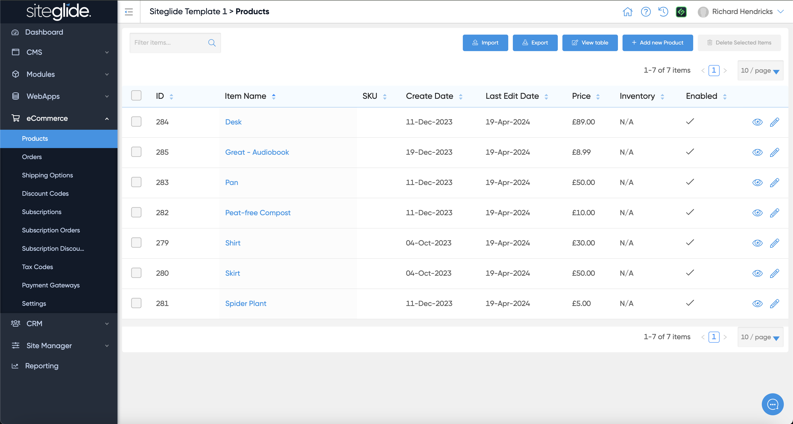<figcaption></figcaption></figure>

## Step 3: Product List Layout

To display the Products on the website you will need to setup the Product List Layout.&#x20;


This will already be done for you if you use our eCommerce Template.


You can install a Layout via SiteBuilder:

<figure>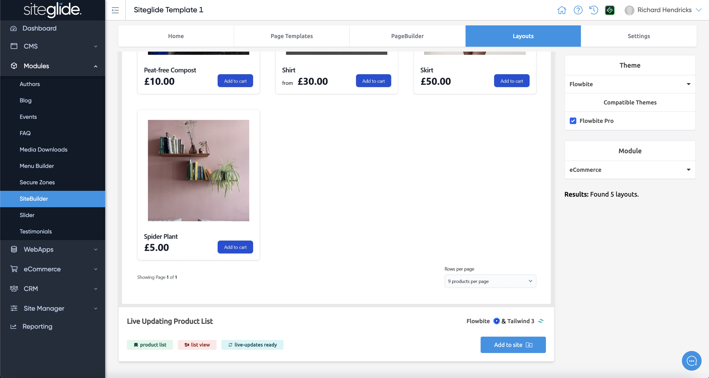<figcaption></figcaption></figure>

You then need to choose where to output the list of Products, in this example (the eCommerce Template) we are listing all products on the Shop page using the pl-1 layout from SiteBuilder:

<figure>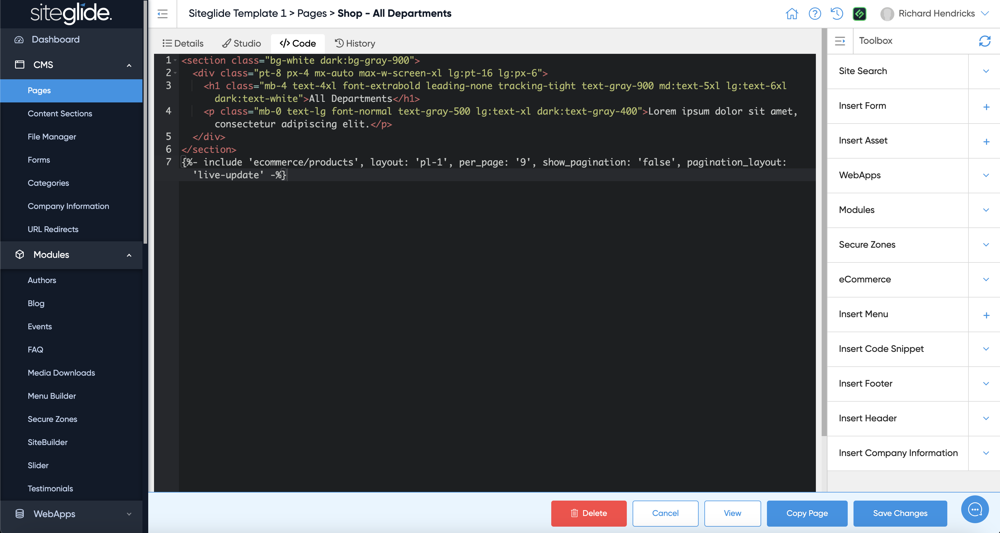<figcaption></figcaption></figure>

Once done you can preview the page and see the items:

<figure>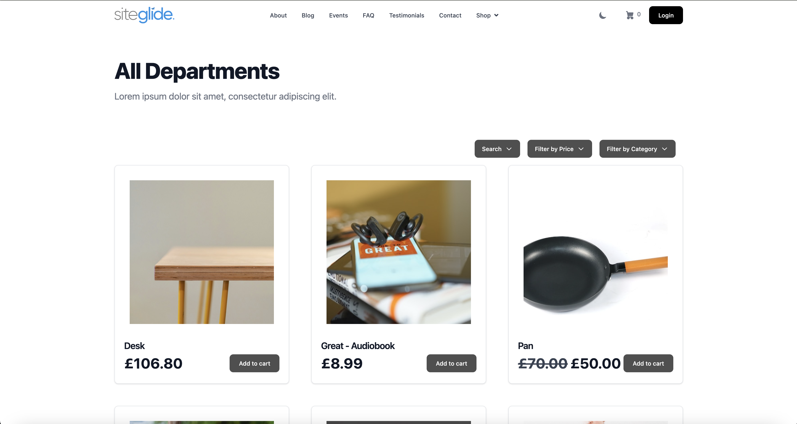<figcaption></figcaption></figure>

## Step 4: Product Detail Layout

To be able to click into a product and view more details than shown on the list view you will need to setup a Product Detail Layout.

We recommend doing this via SiteBuilder but you can code one from scratch too:

<figure>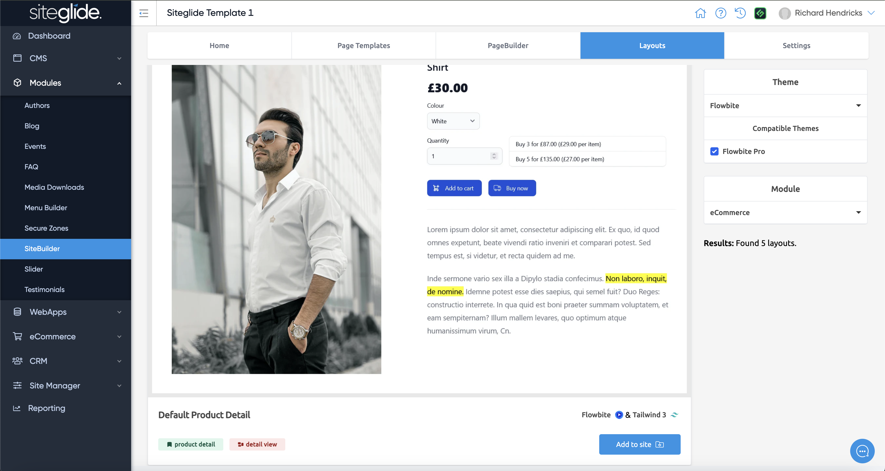<figcaption></figcaption></figure>

You then need to set the Detail Layout in the Product Table settings by clicking blue 'View Table' button:

<figure><figcaption></figcaption></figure>

Then select the Detail Layout, you should see the Layout you've just installed via SiteBuilder:

<figure>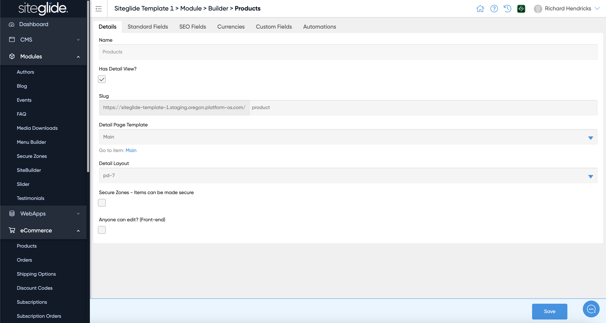<figcaption></figcaption></figure>

## Step 5: Cart Page Layout

Next we'll setup the Cart. Again we'll install a SiteBuilder layout:

<figure>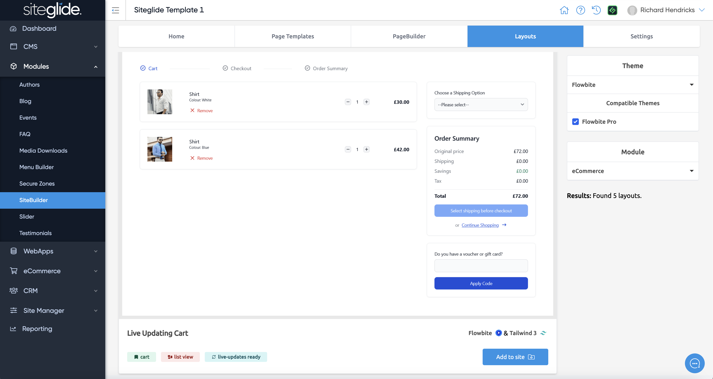<figcaption></figcaption></figure>

Then output the cart onto a page using the new layout:

<figure><figcaption></figcaption></figure>

You can then view the Cart Page:

<figure>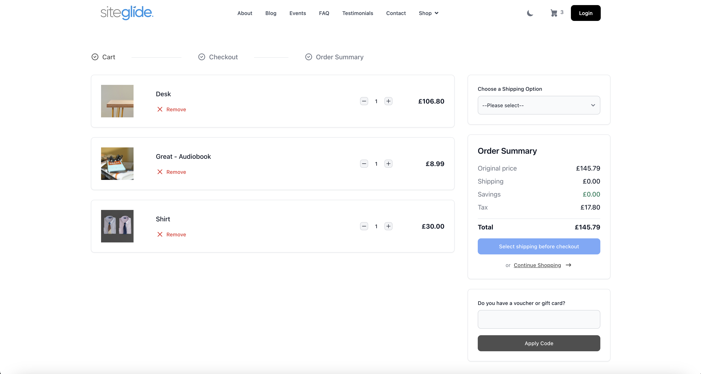<figcaption></figcaption></figure>

## Step 6: Checkout Page Layout

The Checkout works in a very similar way to the Cart but the Checkout Layouts in SiteBuilder can be found under Forms not eCommerce:

<figure>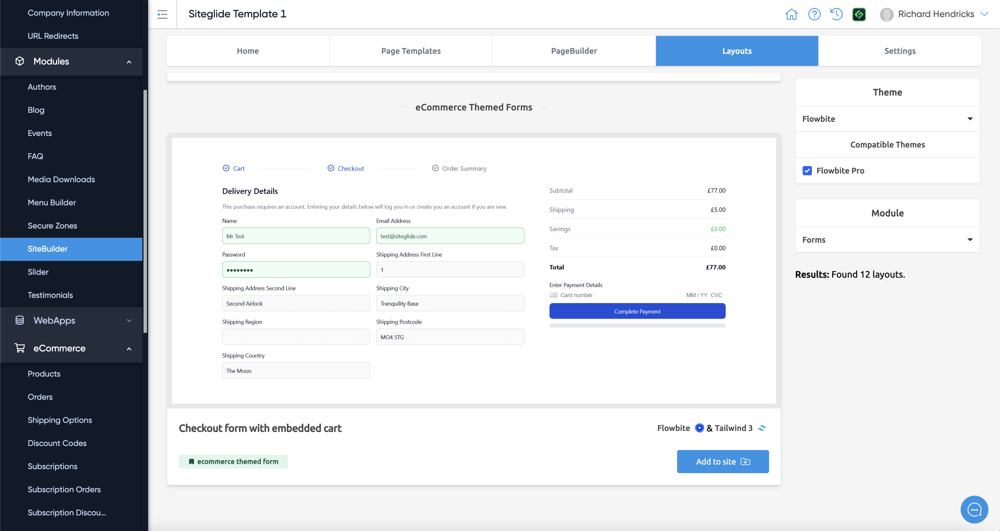<figcaption></figcaption></figure>

Then insert the Checkout onto a page using the new Layout:

<figure>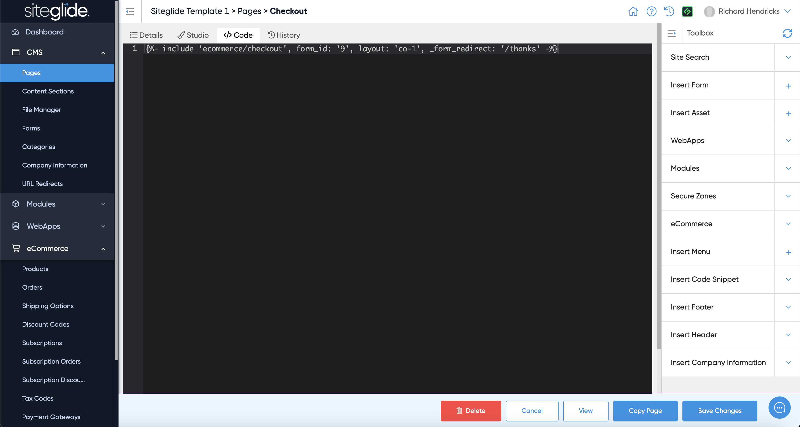<figcaption></figcaption></figure>

Finally you can view the Checkout page to check it's all working correctly:

<figure>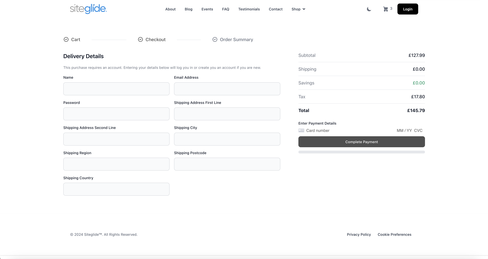<figcaption></figcaption></figure>

## Step 7: Setup your Payment Gateway

You can run multiple payment gateways on Siteglide but we strongly recommend using Stripe. Here's an example of how to get setup with Stripe very easily as it's fully integrated:

<figure>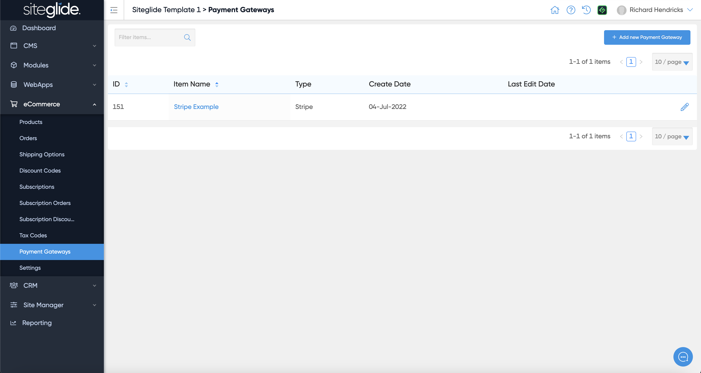<figcaption></figcaption></figure>

You simply need to add your Live and Test Public Keys/Secret Keys. We recommend using the Test Keys first until you're ready to make a real payment:

<figure>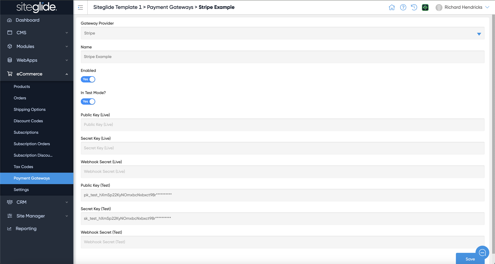<figcaption></figcaption></figure>

## Next Steps

You can totally customise how your eCommerce store works in Siteglide. Here are a few features you might want to look at next:
/ecommerce/get-started-ecommerce/cart-checkout-and-quotes/product-views/shipping-selection/shipping-options

[shipping-options.md](../ecommerce/get-started-ecommerce/cart-checkout-and-quotes/product-views/shipping-selection/shipping-options.md)



[discount-codes.md](../ecommerce/get-started-ecommerce/cart-checkout-and-quotes/product-views/discount-selection/discount-codes.md)



[about-the-ecommerce-module.md](../eCommerce/get-started-ecommerce/about-the-ecommerce-module.md)

