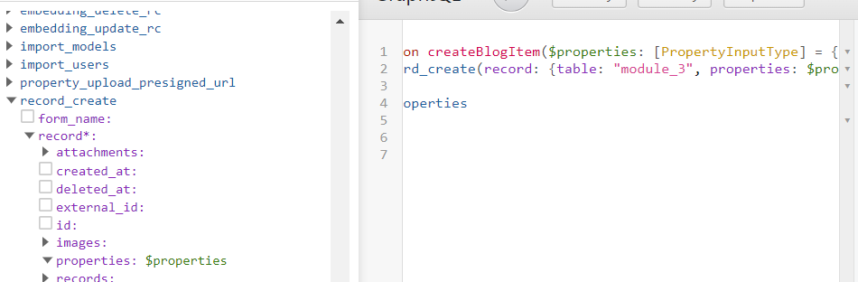

# Tutorial 9 - Using Mutations to Create New Records

## Introduction

So far, these tutorials have used GraphQL queries; in this article we're going to start looking at mutations.

The difference between queries and mutations is that:

* Queries "read" data from the database
* Mutations "create", "update" or "delete" data.

Keeping these types of operations separate is helpful, as it means you can be confident that running a query will not endanger the database on a live site.

## "With Great Power Comes Great Responsibility"

* When learning and testing GraphQL mutations, we strongly recommend you do so on a staging site.
* If you need to test with real data, we recommend using the Siteglide Portal's Site Copy feature to create a staging site clone of a production site with a copy of the database.
* Siteglide may not be able to recover the exact state of data as it was before running a mutation which modifies that data.
* See [Tutorial 11 - Using Mutations to Delete an Item](../Siteglide%20Developer%20Documentation/Tutorial%2011%20-%20Using%20Mutations%20to%20Delete%20an%20Item.md) for more tips on what to do if you accidentally delete data you didn't mean to. (This won't help if you accidentally _change the properties!)_

## Steps for Creating a New Record

### Step 1 - Start with the Mutation Keyword

All queries started with the `query` keyword; mutations start with the `mutation` keyword.

```graphql
mutation nameMyMutation {

}
```

If using explorer, click the dropdown to select mutation instead of query, to unlock different options:


### Step 2) Select the "record\_create" mutation type

This will create a new record (or user\_create to create a new CRM user.)

```graphql
mutation createWebAppItem{
  record_create(
  
  ) {
  
  }
}

```


### Step 3 - use the record object to define the new record

The required `record` object allows you to define both the properties of the new record and which table it should belong to.

Setting the table allows you to define which module or webapp it will belong to:

```graphql
mutation createWebAppItem{
  record_create(
    record: {
      table: "webapp_1",
      properties: [
        {
          name: "webapp_field_1_1",
          value: "foo"
        },
        {
          name: "webapp_field_1_2",
          value: "bar"
        }
      ]
    }
  ) {}
}
```

```graphql
mutation createBlogItem{
  record_create(
    record: {
      table: "module_3",
      properties: [
        {
          name: "module_field_3_1", #title
          value: "Blog 1"
        },
        {
          name: "module_field_3_3", #description
          value: "Lorem Ipsum"
        },
        {
          name: "category_array",
          value_array: ["1"] # where each item in the array is a category ID
      ]
    }
  ) {}
}
```

As with queries, the explorer UI cannot handle multiple properties in a mutation. You can use the explorer to figure out which individual property types are possible and then add the code manually. `properties` itself can be written as an array with each object inside the array defining a property to set.


#### Data Types

Each property must have a name which matches the ID of the field or custom field in Siteglide. When setting a value, you need to select a property value, value\_array, value\_boolean etc. depending on the platformOS type of data the field expects.

To figure out the correct one, you can reference this page [Field Types](../Siteglide%20Developer%20Documentation/Field%20Types.md) which will show which platformOS types are used by each Siteglide type.

To find out which Siteglide types your table uses for each field, go to the corresponding WebApp or Module in the Siteglide Admin, or you can use this query to see each field's ID and Siteglide types together (you can also change the filter and properties to see which other tables are available):

```graphql
query inspectBlogFieldsAndTypes {
  admin_forms(filter: {name: {value: "module_3"}}) {
    results {
      fields
    }
  }
}
```

When using boolean, float or integer, you don't need to use quotes.

```graphql
value_booelan: true,

value_float: 3.456
```

### Step 4 - add results

While results are generally less useful in a mutation than in a query, having at least one result is generally required and your mutation won't work properly without it. The idea is simply to give you information about the record in the database after the mutation to confirm that the mutation was successful - even if this is simply an ID.

Mutations which affect multiple records at once often have a `count` result which only returns the number of records created.

You can add the results you need in the curly braces after the round brackets which follow `record_create`

```graphql
mutation createBlogItem{
  record_create(
    record: {
      table: "module_3",
      properties: [
        {
          name: "module_field_3_1", 
          value: "Blog 1"
        },
        {
          name: "module_field_3_3", 
          value: "Lorem Ipsum"
        },
        {
          name: "category_array",
          value_array: ["1"]
      ]
    }
  ) {
    id #note there is no need to add a results object here like you would in a query. This returns the brand new item's automatically system-generated ID
    properties # returns an object containing the values of your properties which you passed in.
  }
}
```

If successful, your results should return like this:

```graphql
{
  "data": {
    "record_create": {
      "id": "97",
      "properties": {
        "name": null,
        "slug": null,
        "og_url": null,
        "address": null,
        "enabled": null,
        "og_desc": null,
        "og_type": null,
        "location": null,
        "og_image": null,
        "og_title": null,
        "meta_desc": null,
        "weighting": null,
        "meta_title": null,
        "expiry_date": null,
        "release_date": null,
        "twitter_type": null,
        "category_array": [
          "1"
        ],
        "module_field_3_1": "Blog 1",
        "module_field_3_2": null,
        "module_field_3_3": "Lorem Ipsum",
        "module_field_3_4": null,
        "module_field_3_5": null,
        "module_field_3_6": null,
        "module_field_3_7": null,
        "module_field_3_8": null,
        "module_field_3_9": null,
        "secure_zone_array": []
      }
    }
  }
}
```

If you have an error, the error information will display instead of the results. In this case, value\_int was used instead of value for the Blog Item's title:

```graphql
{
  "errors": [
    {
      "message": "Argument 'value_int' on InputObject 'PropertyInputType' has an invalid value (\"Blog 1\"). Expected type 'Int'.",
      "locations": [
        {
          "line": 6,
          "column": 9
        }
      ],
      "path": [
        "mutation createBlogItem",
        "record_create",
        "record",
        "properties",
        0,
        "value_int"
      ],
      "extensions": {
        "code": "argumentLiteralsIncompatible",
        "typeName": "InputObject",
        "argumentName": "value_int"
      }
    }
  ]
}
```

## Step 5 - Pass in variables

We covered variables in more detail in [Tutorial 6 - Variables](../Siteglide%20Developer%20Documentation/Tutorial%206%20-%20Variables.md) but they are just as useful in mutations!

In the following example, variables are added to pass in data programatically to create the new Blog post:

```graphql
mutation createBlogItem($title: String!, $description: String!, $categories: [String]) {
  record_create(
    record: {
      table: "module_3",
      properties: [
        {
          name: "module_field_3_1", 
          value: $title
        },
        {
          name: "module_field_3_3", 
          value: $description
        },
        {
          name: "category_array",
          value_array: $categories
      ]
    }
  ) {
    id #note there is no need to add a results object here like you would in a query. This returns the brand new item's automatically system-generated ID
    properties # returns an object containing the values of your properties which you passed in.
  }
}
```


\`\`\`liquid \{% assign description = "Lorem Ipsum" %\} \{% graphql createBlogItem = "create\_blog\_item", title: "The newest Blog Post", description: description %\}

````

</div>

</div>

### Advanced - Using variables to pass in entire objects in GraphQL rather than single properties

This is an advanced technique and you can skip it if you want to continue learning the basics of mutations.

If you like, you can use a variable to represent the entire properties object and pass in JSON which defines all the properties at once. Why? It might save time (or not), depending on the kind of data you have available. It may also make the mutation more re-usable. Learning advanced skills like this may give you more options as a developer and you may come across a situation where it's useful.

Note how the `parse_json `tag is used with literal square brackets to create a JSON array with nested objects defined by curly braces. The `category_array `property is an example of how you can pull in Liquid from different sources into these properies, though `this.id` would only contain a category ID in for example a category detail layout.

<div data-gb-custom-block data-tag="tabs"></div>

<div data-gb-custom-block data-tag="tab" data-title='GraphQL'>

```graphql
mutation createBlogItem($properties: [PropertyInputType!]!) {
  record_create(record: {table: "module_3", properties: $properties}) {
    id
    properties
  }
}
````


\`\`\`liquid \{% parse\_json properties %\} \[ { "name": "webapp\_field\_3\_1", "value": "Blog Title" }, { "name": "webapp\_field\_3\_3", "value": "Lorem Ipsum" }, { "name": "category\_array", "value\_array": \[\{{this.id\}}] } ] \{% endparse\_json %\} \{% graphql createBlogItem = "create\_blog\_item", properties: properties %\}

```

</div>

</div>

Note, the structure of the JSON we are passing in the previous example is similar to the structure of properties in the mutation, but it is necessary in JSON to use double quotes around the keys like `name`:, while the GraphQL syntax needs no quotes.

Using explorer to turn properties into a variable is a quick way to reference the required type for the complex variable `[PropertyInputType]`:



# Conclusion

That's it! You should now be able to create Siteglide WebApp and Module items programatically using mutations.&#x20;

You could experiment with the `user_create` mutation to create users. Instead of a record object this will have a `user` object which accepts a required `email` property.

# Related Articles

*   [Tutorial 8 - Building a Liquid API GET Endpoint Page powered by GraphQL queries](<../Siteglide Developer Documentation/Tutorial 8 - Building a Liquid API GET Endpoint Page powered by GraphQL queries.md>) - combining what you've learned in Tutorial 8 and 9, you should be able to create an API where the Liquid endpoint runs a mutation to create items. You could use this alongside a custom form to allow the user to enter properties which are then passed to the endpoint in the URL and then finally into the mutation via variables.

# Next Time

In the next tutorial, we'll look at more examples of mutations, including mutations to update and delete records.
```
