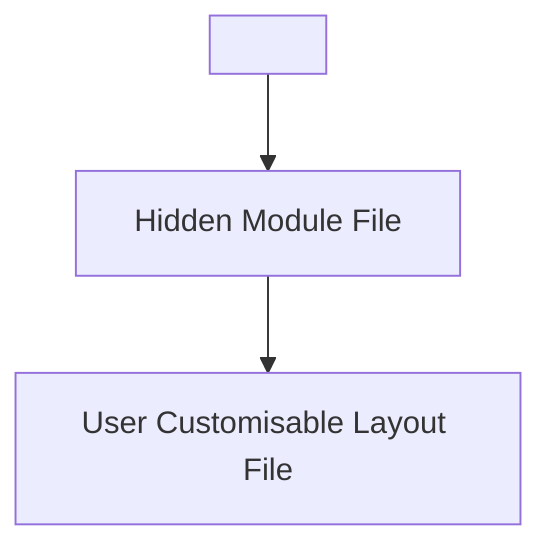

# 💡 About Includes (Partials)

Includes, also known as partials on platformOS, are Liquid files which are smaller than a Page or Page Template, but which are intended to be included more than once in a Site.

Using includes can have the following benefits:

* It allows you to use code from other sources, for example, from a Siteglide Module
* It allows you to save time writing code- where the code should be the same or similar in two places, you can include the same include in both places, using Liquid logic to achieve small differences based on contextual variables.&#x20;
* It allows you to save time maintaining code- as bug fixes can be handled in one place
* It keeps your code tidy, as you are able to abstract a particular function into one place

## Types of Include

### Content Sections

One kind of include which is easy for clients and agencies alike to access from the Siteglide Admin, if their user roles allow.&#x20;

### Code Snippets

One kind of include which is easy for clients and agencies alike to access from the Siteglide Admin, if their user-roles allow. The only difference between Content Sections and Code Snippets is organisational: they are functionally the same, but generally Content Sections will contain functional front-end HTML, whereas Code Snippets are more likely to contain invisible `<head>` metadata or `JavaScript` code. This is not a rule, and it's up to agencies how they use them.

### WebApps, Modules and More Includes From Siteglide

Throughout our documentation, we'll give you the code to add a feature to your site and it will contain an include tag. Usually this will include a hidden Liquid file from the Siteglide module which controls key functionality and fetches important data, which will then in turn include the layout file which you can customise yourself.

### Diagram of Include Tag Structure

### Custom Path

a

