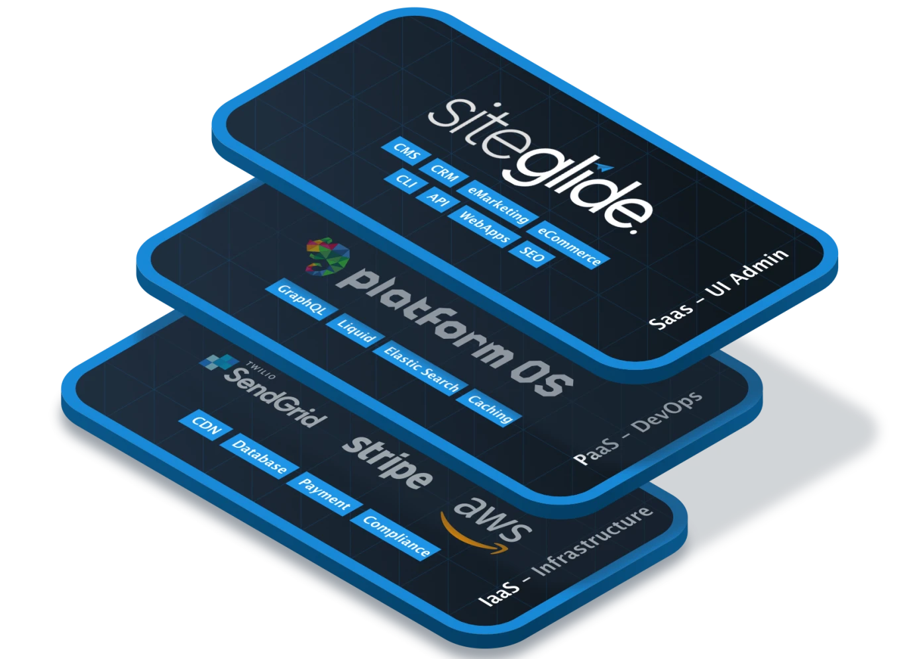

# 🔹 Siteglide Technology Stack

## Which Tools Should I Use to Work with Siteglide?

There are a few main ways to work with your Siteglide Site:

* Using the [Siteglide Admin](https://admin.siteglide.com/#/portal) - Create an Account and use the User Interface to explore and build your Site. If you have any questions, use our live chat button to get help.
* Using the [Siteglide CLI](broken-reference) - Efficiently work directly with your Site's code on your own machine.

## Which Coding Languages are used in Siteglide?


Wait I'm not a developer?\
\
Don't worry, Siteglide has low-code tools like Studio, Toolbox and SiteBuilder to help Designers and Agents get stuck in as well!


In the course of this Documentation, you will probably come across the following languages that we use in many of our features and examples:

* HTML - The standard Markup Language of the web. [Learn more at MDN](https://developer.mozilla.org/en-US/docs/Web/HTML)
* JavaScript - The standard client-side scripting language of the web. [Learn more at MDN](https://developer.mozilla.org/en-US/docs/Web/JavaScript)
* YAML - Used by Siteglide to store settings like page metadata, normally at the top of Liquid files.
* Liquid - Used by Siteglide for dynamic server-side rendering of HTML and other languages.
* GraphQL - Used by Siteglide to query the database and modify data. Often for beginners this will be tucked away inside our features, but learning it allows you to unlock more powerful possibilities.

## Partner and 3rd Party Documentation

<figure><figcaption>
An enterprise-grade infrastructure that delivers optimum security, reliability, flexibility, scalability and performance.
</figcaption></figure>

[Siteglide](https://siteglide.com/) works very closely with our partners at [platformOS](https://www.platformos.com/) to provide you with all the benefits of a modern cloud-based infrastructure like AWS, while at the same time making your life easier so you can focus on delivering the best for your clients.&#x20;

platformOS are behind a lot of the code used on Siteglide sites, developing everything from new Liquid filters on top of Liquid's open-source starting point and a fully functional GraphQL schema you can plug into for making database queries and mutating to modify data. \
\
We also work with a range of other open-source and 3rd party technologies to bring you our full suite of features.&#x20;

In our documentation we will often direct you to the [pOS documentation](https://documentation.platformos.com/) and those of other 3rd parties to help you dig deeper into what it is possible to build. platformOS have won awards for their innovative documentation and we will try not to re-invent the wheel when we cover the same topics as them, but instead hope to present topics like GraphQL with a more beginner-friendly slant.&#x20;

Most platformOS features can be built on Siteglide - if you find one you like and are not sure if it's supported yet, we encourage you to let us know about it.&#x20;
