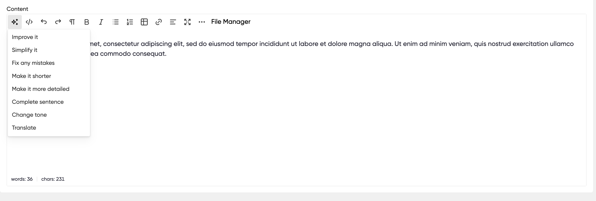

# ℹ️ AI Tools for the Rich Text Editor


While this is now available for all users it is still in Beta and we value any feedback or reports of issues as at 14th October 2024. We'll update this page in due course.

Do be aware that changing existing content will likely remove any existing formatting because it replacing your content. This is expected behaviour and best used for new content.


The Rich Text Editor (RTE) is used for formatting on Multi-line text fields on WebApps, Modules etc and includes AI tools to help write and improve content.

<figure><figcaption></figcaption></figure>

You can write a sentence or a few words and then use one of the prompts to edit the content accordingly. This is great for writing blog posts, translating pages and improving content as a whole.
