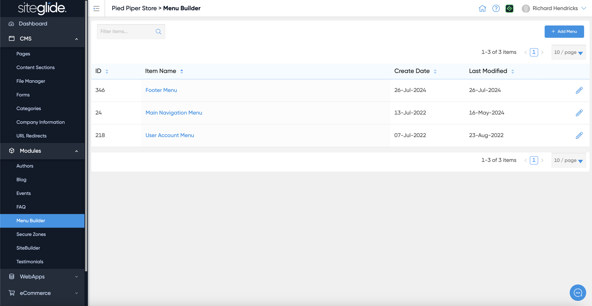
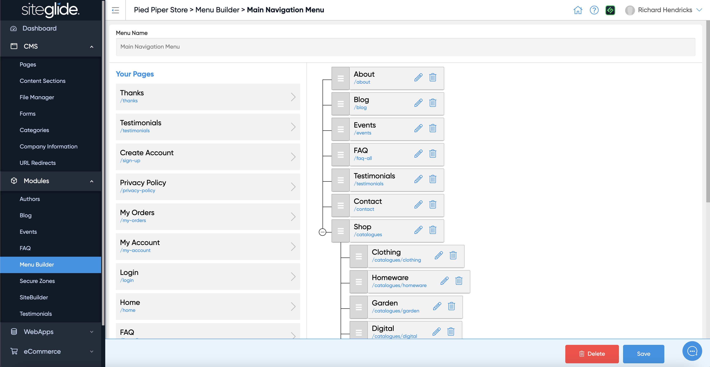
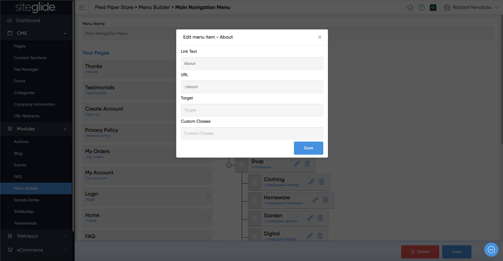

# 🚀 Quickstart: Menu Builder

## Step 1: Create a Menu or Edit and Existing:

Menu Builder sits under Modules and within there you will see any existing Menus or can create a new one:

<figure><figcaption></figcaption></figure>

## Step 2: Manage Items

Add Pages and use the drag and drop tool to re-order or create hierarchy/drop-downs:

<figure><figcaption></figcaption></figure>

## Step 3: Edit Items

You can edit the Name, URL, Target and Custom Classes of any items:

<figure><figcaption></figcaption></figure>

The most likely Target setting you'd want to add would be '\_blank', this would open in a new tab when clicked:

```
_blank
```

If you know any specific CSS classes you can add them, this might be to define an item as a parent item for example.

