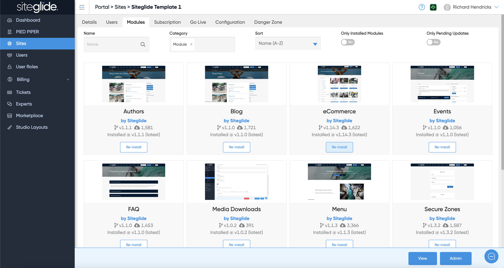
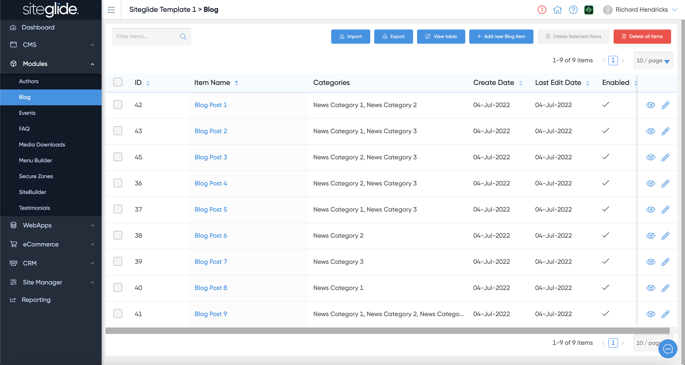
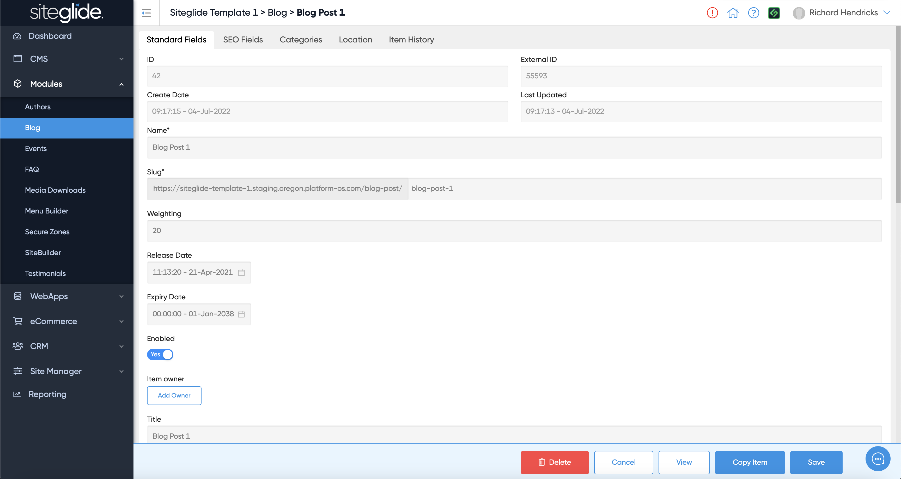
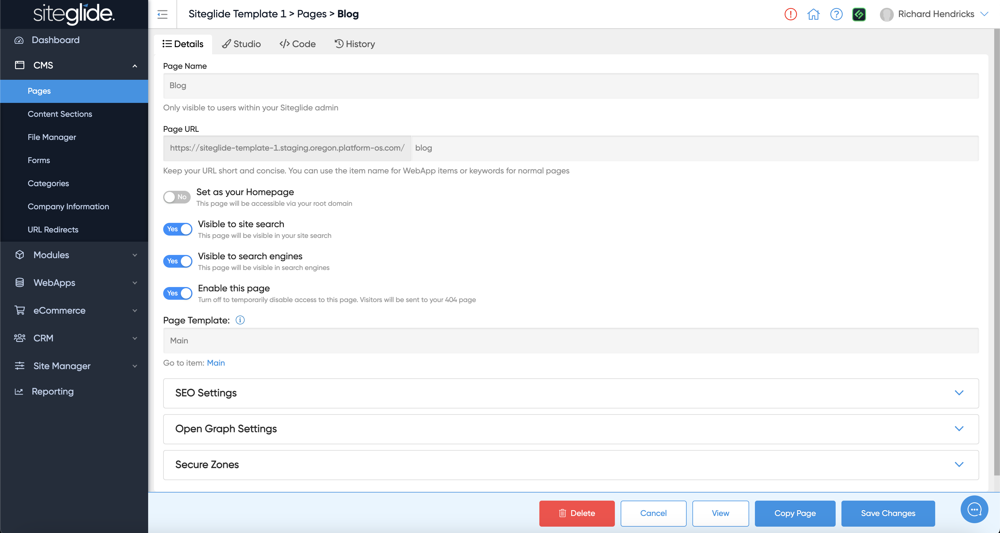

# 🚀 Quickstart


If you use one of our Site Builder templates these steps will already be done for you and all you need to do is customise the Blog. This is our recommended route: [quickstart-sitebuilder.md](../../../sitebuilder/setup-sitebuilder/quickstart-sitebuilder.md "mention")


## Step 1: Install the Modules

Go to the Modules tab under the Site you want to work on in Portal and click install on Blog and Authors. They may already be installed if you're using a Template or existing site:

<figure><figcaption></figcaption></figure>

More on Installing and Managing Modules:


[install-and-manage-modules.md](../../../portal/sites/install-and-manage-modules.md)


## Step 2: Create Items

Go to the Module page within the Site and either edit an existing item or create a new one:

<figure><figcaption></figcaption></figure>

Give it a name and fill in other fields you might want to use:

<figure><figcaption></figcaption></figure>

## Step 3: Setup the Pages/Layouts

You then need to output the Blog on the site. You'll likely want to create a Page called Blog:

<figure><figcaption></figcaption></figure>

You then output it on the page using Toolbox (or via CLI):

<figure><figcaption></figcaption></figure>

## Step 4: Customising the Layouts or Functionality:

Your Blog will work out of the box but Siteglide is all about flexibility and recognising each project is different. You have total control to customise the Layouts and how the Blog works. We recommend looking at the SiteBuilder Blog Layouts as a starting point as there might be existing Layouts that can save you a lot of time.


[dynamic-layouts-in-sitebuilder.md](../../../sitebuilder/setup-sitebuilder/layouts/about-layouts/dynamic-layouts-in-sitebuilder.md)

