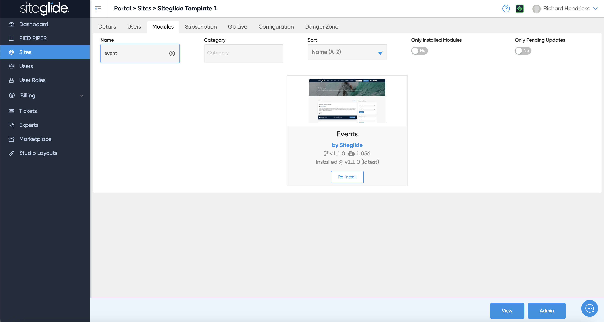
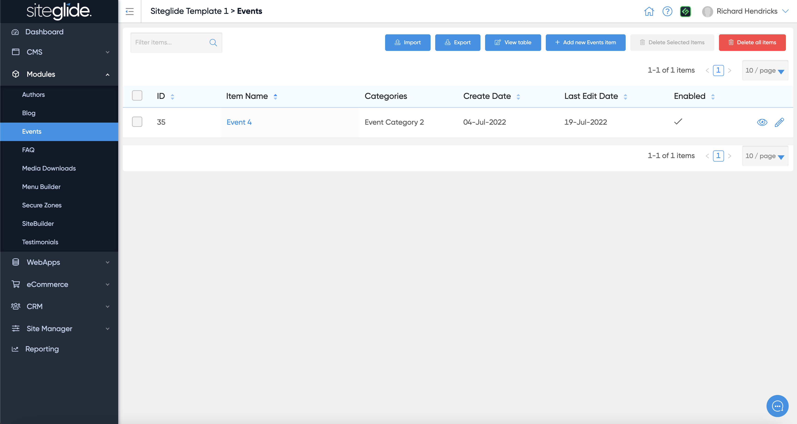
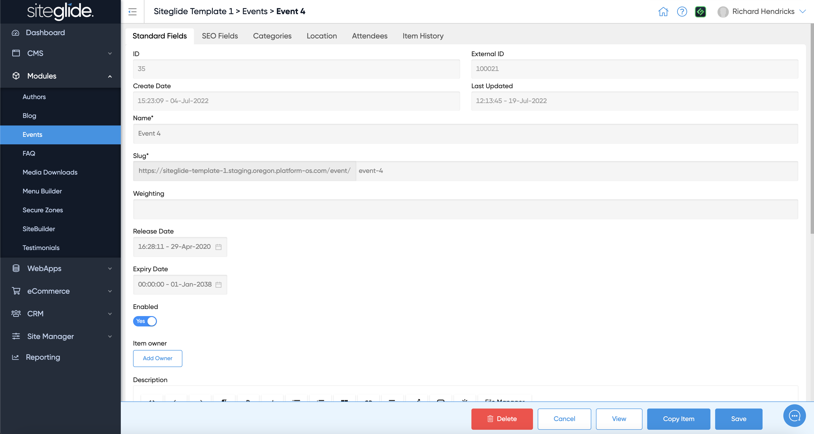
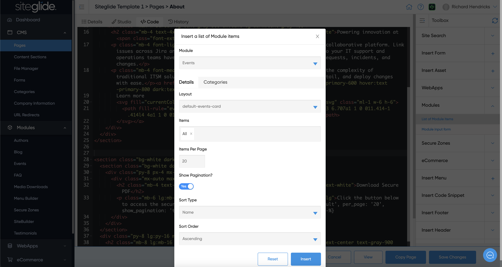

# 🚀 Quickstart: Events


If you use one of our Site Builder templates these steps will already be done for you and all you need to do is customise the Layouts etc. This is our recommended route: [quickstart-sitebuilder.md](../../../sitebuilder/setup-sitebuilder/quickstart-sitebuilder.md "mention")


## Step 1: Install the Events Module

Install from the Modules tab on the Site you're working on from Portal:

<figure><figcaption></figcaption></figure>

For more information on how to install and manage modules:


[install-and-manage-modules.md](../../../portal/sites/install-and-manage-modules.md)


## Step 2: Create Event Items or Edit Existing

Create or manage existing items:

<figure><figcaption></figcaption></figure>

Give it a name and fill in any other fields:

<figure><figcaption></figcaption></figure>

## Step 3: Setup the Pages/Layouts

You then need to output the Events on the site. You'll likely want to create a Page called Events:

<figure><figcaption></figcaption></figure>

## Step 4: Customising the Layouts or Functionality:

Your Events will work out of the box but Siteglide is all about flexibility and recognising each project is different. You have total control to customise the Layouts and how the Events Module works. We recommend looking at the SiteBuilder Events Layouts as a starting point as there might be existing Layouts that can save you a lot of time.


[dynamic-layouts-in-sitebuilder.md](../../../sitebuilder/setup-sitebuilder/layouts/about-layouts/dynamic-layouts-in-sitebuilder.md)

