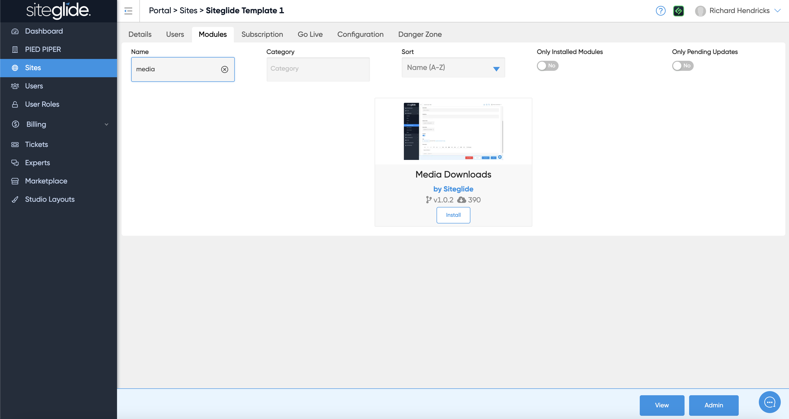
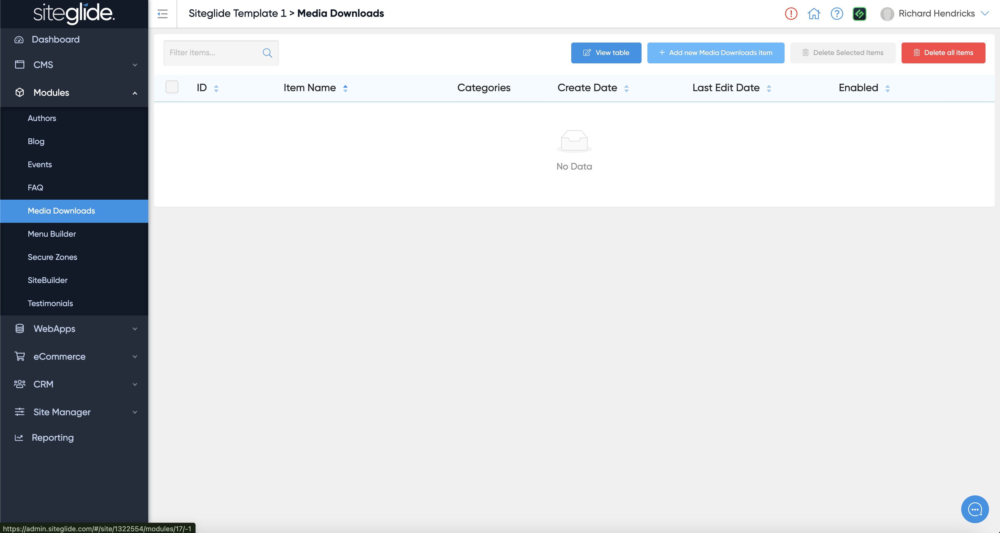
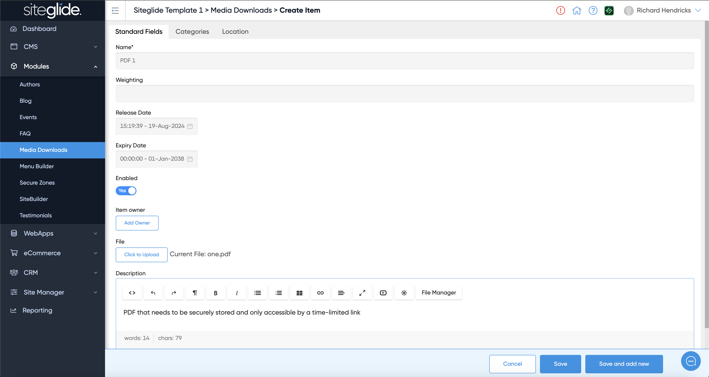
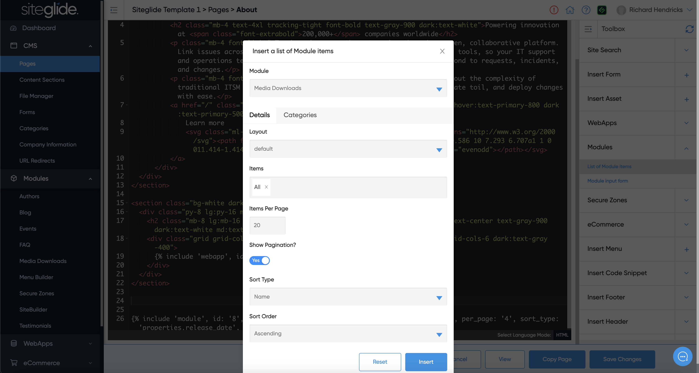

# 🚀 Quickstart

## Step 1: Install the Media Downloads Module

Go to the Modules tab on the Site in Portal and search or find Media Downloads. Then click install:

<figure><figcaption></figcaption></figure>

More on Installing and Managing Modules:


[install-and-manage-modules.md](../../../portal/sites/install-and-manage-modules.md)


## Step 2: Create an Item

Go to the Module and create a new Item or edit any existing Items. You can also click view table to edit the Module itself:

<figure><figcaption></figcaption></figure>

Give the item a name, upload a file (typically PDFs) and give it a description (optional):

<figure><figcaption></figcaption></figure>

## Step 3: Output on a Page

You can output a link to the file on a webpage by using Toolbox:

<figure><figcaption></figcaption></figure>

For full control over the design and functionality you can edit the Layouts:


[layouts.md](layouts.md)


For a full list of fields availabe check out our Reference guide:


[reference.md](reference.md)

