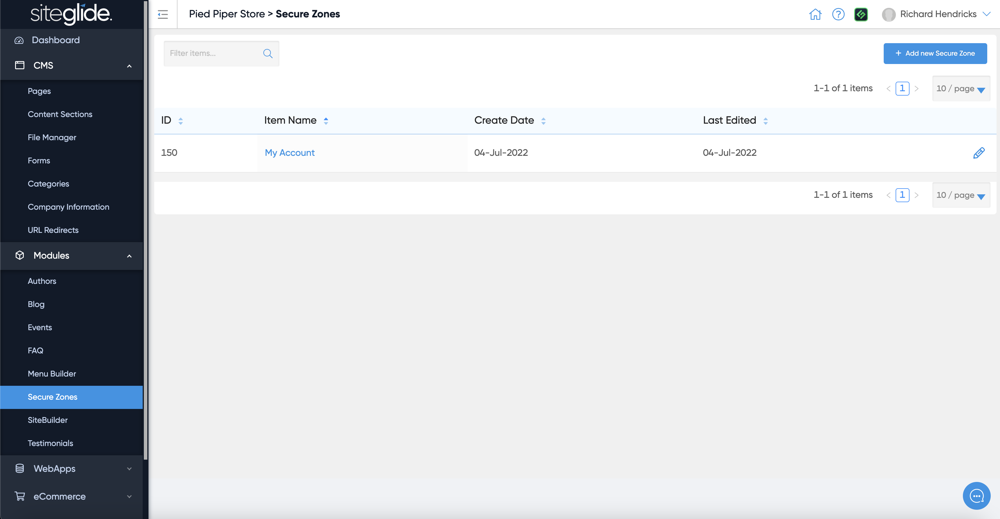
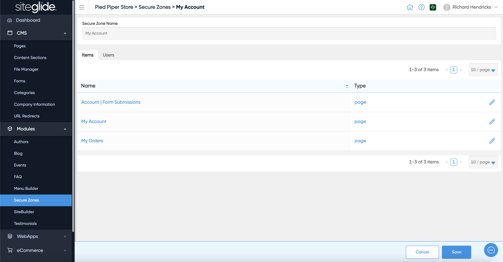
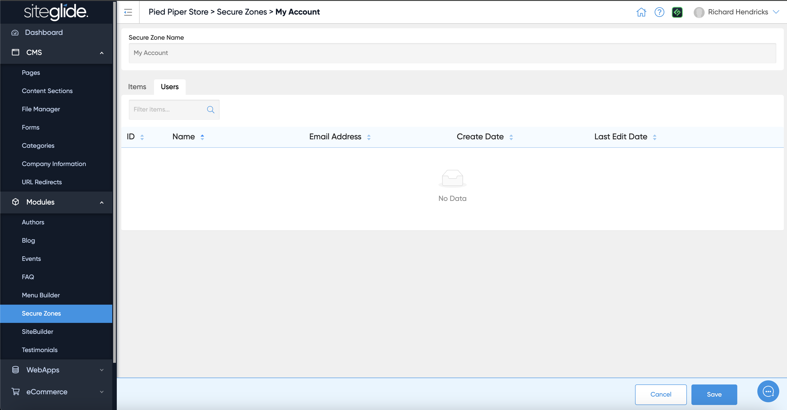
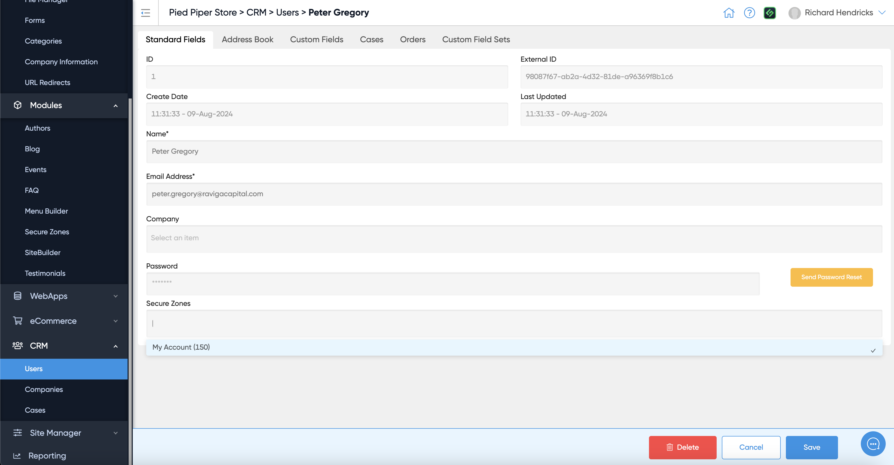

# 🚀 Quickstart: Secure Zones

## Step 1: Create or Edit a Secure Zone

<figure><figcaption></figcaption></figure>

## Step 2: Manage Items

You can see any Pages/Items that are already in the Secure Zone:

<figure><figcaption></figcaption></figure>

To add more items go to a specific Page or Item and add it to the Secure Zone (e.g. a Page has the Secure Zone section at the bottom of the Details tab):

<figure><figcaption></figcaption></figure>

## Step 3: Manage Users

You can also see what Users are assigned to this Secure Zone:

<figure><figcaption></figcaption></figure>

Again, you can add Users to a Secure Zone by going to a specific User in the CRM:

<figure><figcaption></figcaption></figure>
