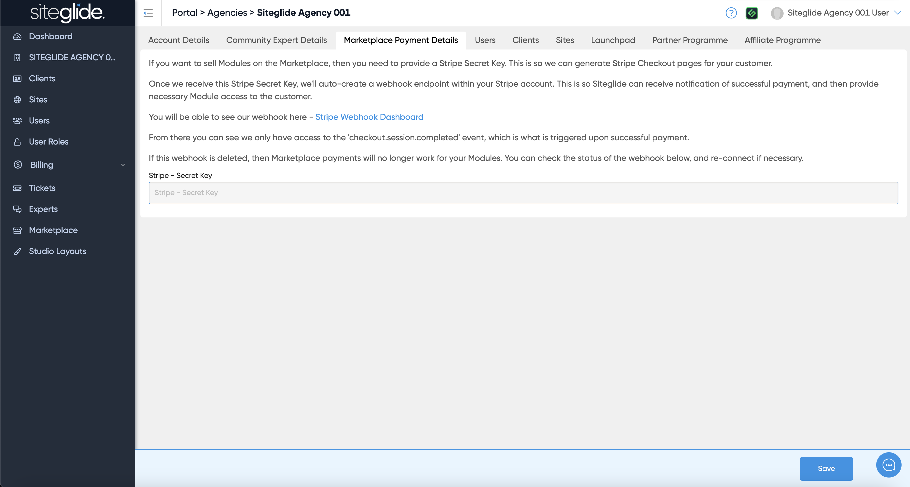
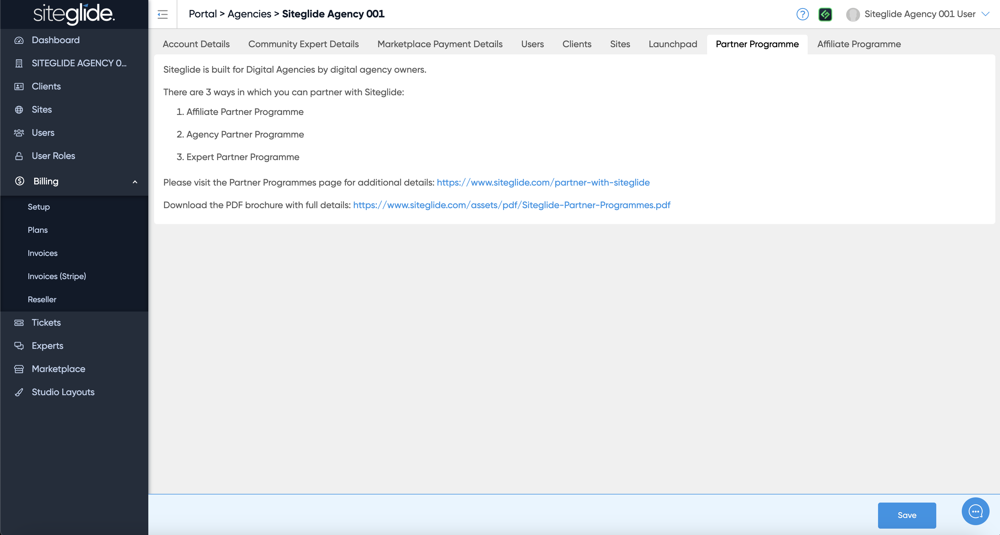
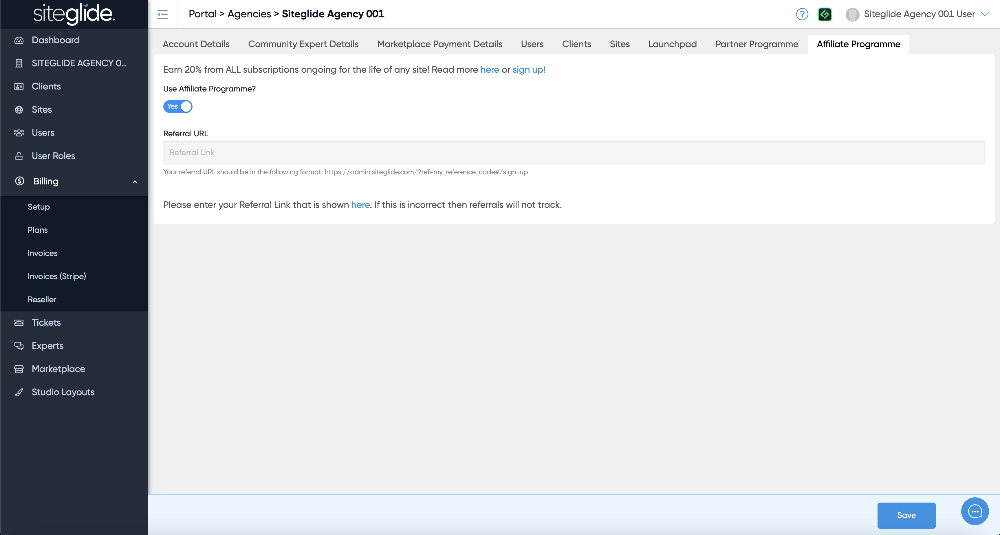

# Agency Account


If you're not an Agency and have a Business account visit: [account.md](../../portal2/account.md "mention")


If you are an approved Siteglide Agency you will have additional features accessible from the tabs across the top:&#x20;

<figure><figcaption></figcaption></figure>

## Community Expert Details

The Community Expert Details tab is where you can brand Siteglide to your Agency and create a page on the Experts area so users in need of your services can find you:

<figure><figcaption></figcaption></figure>

Read more about Whitelabelling Siteglide to your Agency:


[agency-whitelabelling.md](agency-whitelabelling.md)


## Marketplace Payment Details

The Marketplace Payment Details tab allows you to take payments for any Modules you sell in the Marketplace. You would need to use Stripe to take payments and insert your secret key:

<figure><figcaption></figcaption></figure>

## Partner Programme

The Partner Programme tab provides more information on how you can partner with us:

<figure><figcaption></figcaption></figure>

## Affiliate Programme

The Affiliate Programme tab lets you setup and control the affiliate commission for referring new users to Siteglide:

<figure><figcaption></figcaption></figure>
