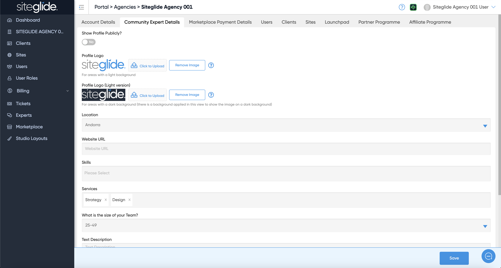

# 👩‍💻 Agency Whitelabelling

​Whitelabelling enables your Agency to re-brand the Siteglide portal by replacing our logo with your own. Re-branding the platform in this way means you are able to provide a more consistent, branded and streamlined service to your clients and maintain a single point of contact with them.

Over time we will continue increasing coverage of the whitelabling capabilities to include things like domain name, among others.

## Admin Logo

To re-brand your Portal and Admin, head over to the Agency Details page, upload your logo and enable "whitelabelling".

<figure><figcaption></figcaption></figure>

## Login

Below is an Endpoint and example snippets of code you can use to enable your Clients to login to Admin directly from your own Agency website.

You'll need the code below as a minimum. You can then add your own HTML/CSS/JS designs and branding on top.

### HTML and JavaScript

\`\`\`liquidEmail Password

````

</div>

<div data-gb-custom-block data-tag="tab" data-title='JavaScript'>

```javascript
function s_login(el){
	event.preventDefault();
	let form = el.closest('form');
	let data = {
		email: form.querySelector('[name="email"]').value,
		password: form.querySelector('[name="password"]').value
	};
	var xReq = new XMLHttpRequest();
	xReq.open("POST", "https://api.siteglide.co.uk/api/public/general/sessions/login");
	xReq.setRequestHeader("content-type", "application/json");
	xReq.onreadystatechange = function(){
		if(xReq.readyState === 4){
			let response = JSON.parse(xReq.response);
			if(response.error){
				alert(response.error);
			}else if(response.session){
				window.location.href = 'https://admin.siteglide.com/#/public/login?s='+response.session;
			}
		}
	}
	xReq.send(JSON.stringify(data));
}
````
