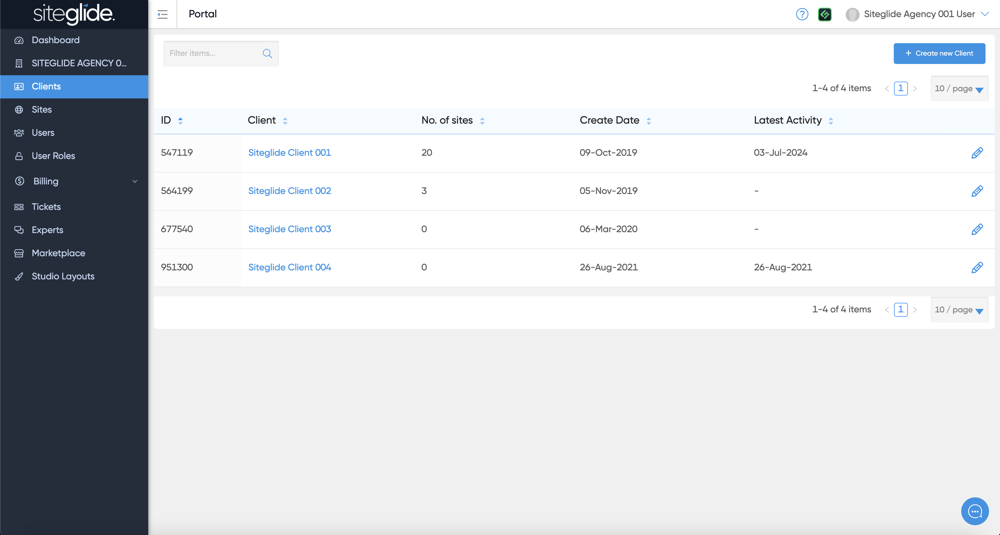
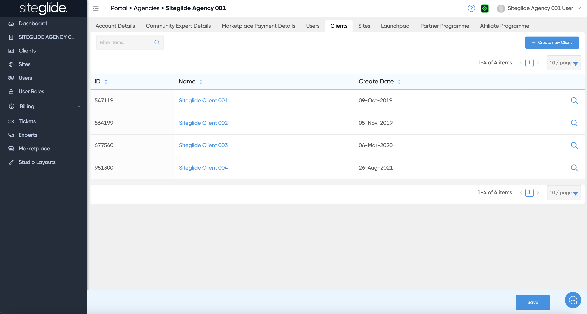
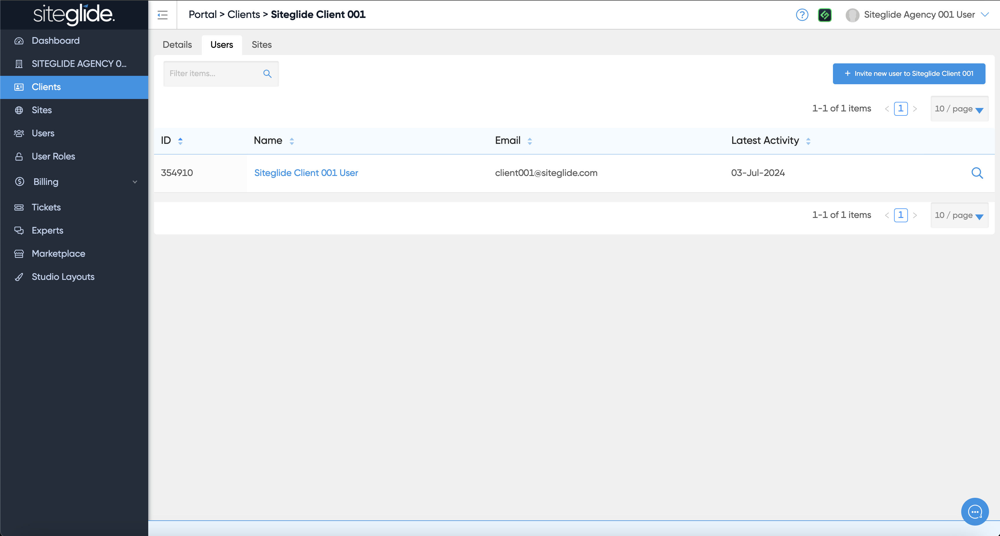
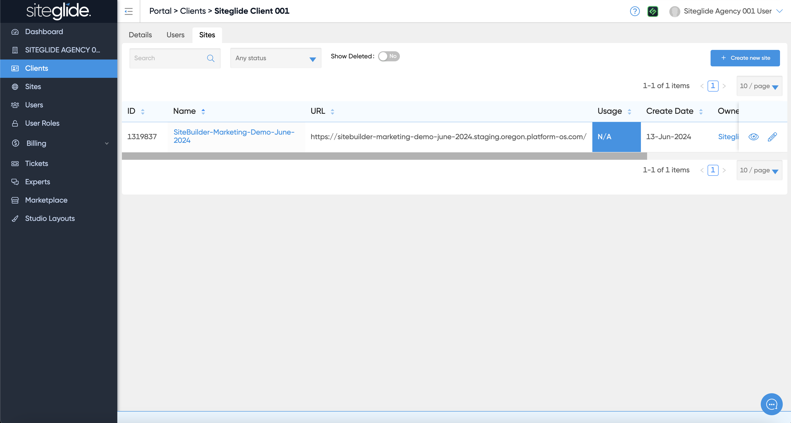

# Clients

The Clients feature in Portal is only available to Agencies and gives you an extra level of management allowing you to group multiple Sites under one Client and control who can see it.

You can access this from the left hand side menu:

<figure><figcaption></figcaption></figure>

But also from within your Agency Account:

<figure><figcaption></figcaption></figure>

You can create unlimited Clients and invite users who would then only have access to that Client area and any Sites linked to it:

<figure><figcaption></figcaption></figure>

<figure><figcaption></figcaption></figure>

