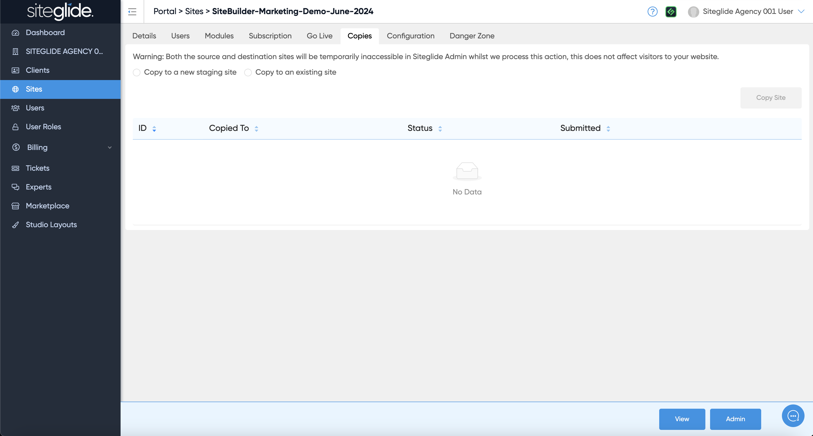
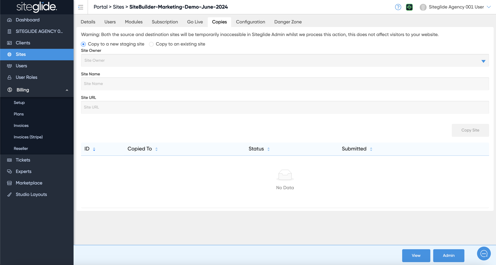
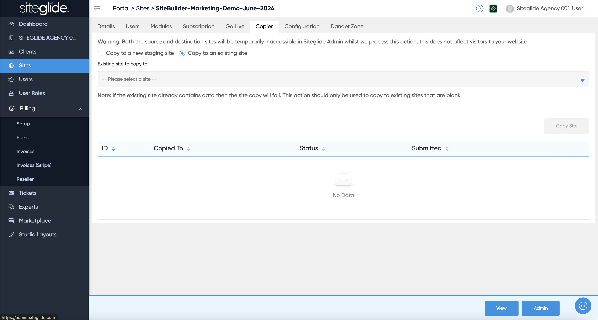

# 👩‍💻 Site Copies

An Agency only feature is being able to make copies of existing sites either to a blank Staging or to an existing Site (can be a Production Site):

<figure><figcaption></figcaption></figure>

To copy to a new Staging Site click the first radio button and then choose the Site Owner (your Agency or a Client folder) and give the Site a Name/URL:

<figure><figcaption></figcaption></figure>

To copy to an existing site (Trial or Production) click the second radio button and then choose the Site from the dropdown:

<figure><figcaption></figcaption></figure>
