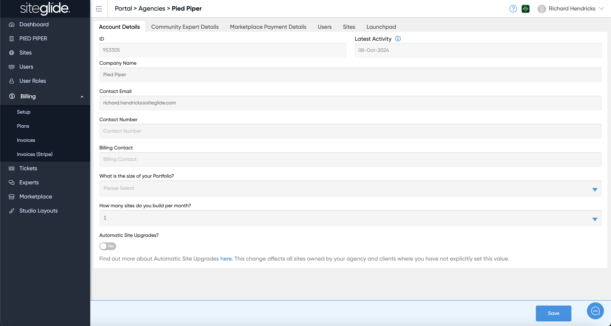
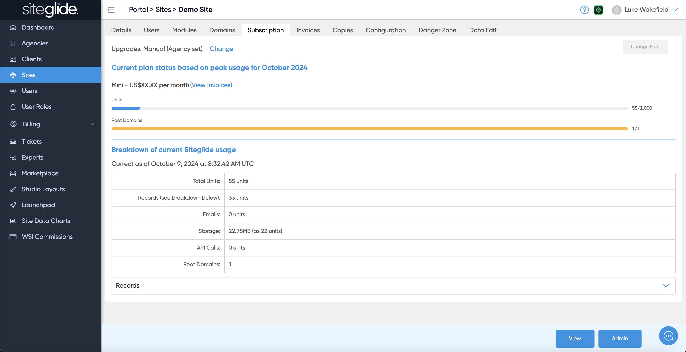
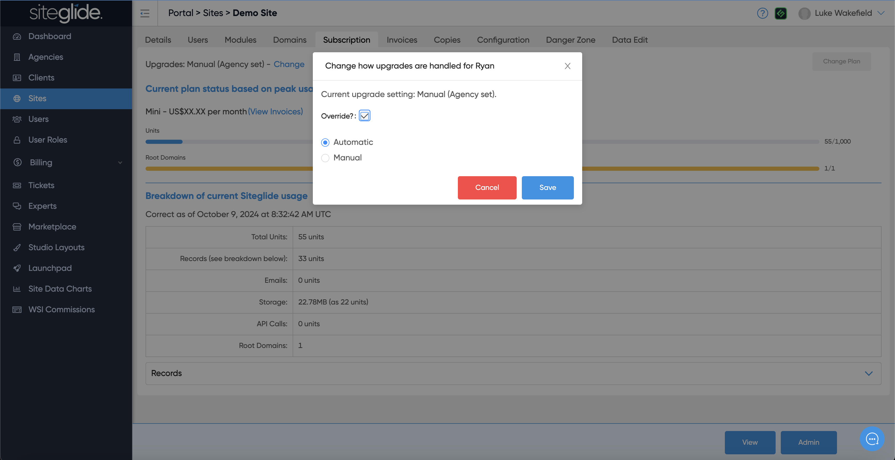

# 💳 Automatic Site Upgrades

Sites can be automatically upgraded to the next available plan on the 1st of the following month if the cost of Extras exceeds the difference in cost to upgrade to the appropriate plan. Automatic upgrades by the system ensure that if usage increases on a site, the cheapest option is chosen and charged.

The default "Agency Global Preferences" is to not allow automatic upgrades. The "Site Preferences Override" has no override set and so will follow your Agency Preference. You can change this setting by following the information below.

***

## Setting Up Your Automatic Upgrade Preferences

Site owners and agencies have granular control over automatic upgrades via Siteglide Portal. You can choose to control the setting either Globally for all of your sites, or individually for specific sites.

**Please ensure you set this up to suit your billing preferences.**

### **Agency Global Preferences**

Within your [Agency Account Details](/portal/agencies/agency-account.md) in Portal, you can choose for the default setting to enable or disable automatic upgrades for all sites within your Agency and Clients.

<figure><figcaption></figcaption></figure>

The "Automatic Site Upgrades?" toggle can be set to two different states:

* **Yes** - Automatic upgrades are turned on for all sites unless you override at site level. Upgrades will take place if it is cheaper than paying Extras
* **No** - Automatic upgrades are turned off for all sites unless you override at site level. No upgrades will take place unless you action them yourself

Once you have chosen a state, make sure to save.

**Note: This preference can be overridden by a selected state applied at the site level.**

## **Site Preferences Override**

Within the [Subscriptions tab](/portal/billing/subscriptions-and-changes.md) for a site, you can choose to override the global preferences and control each site separately.

Above the peak usage table, you'll see the current state for this site and an option to change this.

<figure><figcaption></figcaption></figure>

Click "Change" to open a pop up modal, where you'll be shown the current state for this site and an option to override Global Preferences in two ways.

To override, tick the "Override?" checkbox and select the appropriate state you would like to apply as an override.

To remove an override, untick the "Override?" checkbox.

An override can be set to either of the following states:

* **Automatic** - Automatic upgrades are turned on for this site only. Upgrades will take place if it is cheaper than paying Extras
* **Manual** - Automatic upgrades are turned off for this site only. No upgrades will take place unless you action them yourself

<figure><figcaption></figcaption></figure>

Once you have chosen an override state, make sure you click save.
