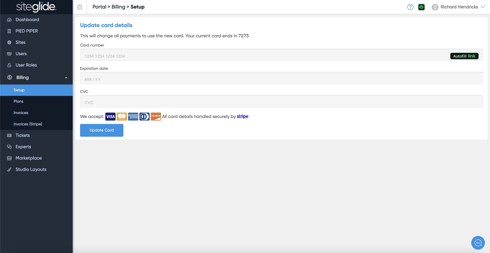

# 💳 Billing Setup

Simply fill in the form to add your card details to the Account. Please note this card will be used for ALL payments unless otherwise stated on the Go Live tab.

If you haven't previously setup Billing on Siteglide it will ask for your Company Name and Address:

<figure><figcaption></figcaption></figure>

If you already have a card on file with us it'll show the last 4 digits but you can replace this card with a new one:

<figure><figcaption></figcaption></figure>
