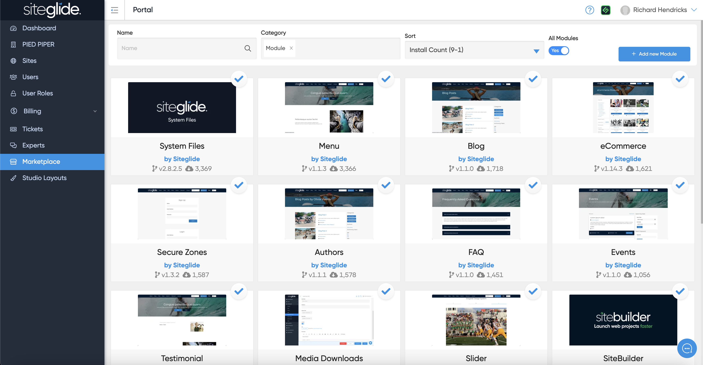

# Marketplace

The Siteglide Marketplace has a variety of useful Modules, Templates, Themes and Integrations.&#x20;

## Core Modules

Some of which have been built by Siteglide so that you can pick and choose which to install onto each site and reduce clutter/usage if they're not required. These are called Core Modules and are denoted by the 'by Siteglide' text under each title:

<figure><figcaption></figcaption></figure>

Find out more about the Core Modules:


[core-modules](../modules/core-modules/)


## Community Modules, Templates, Themes & Integrations

Other Modules, Templates, Themes and Integrations have been built by the Siteglide Community of Experts including our services team, Sitegurus.&#x20;

Sitegurus have built SiteBuilder, a tool to speed up development of web projects while ensuring best practice and quality. Check out the Marketplace Templates that leverage SiteBuilder:


[marketplace-themes-and-templates.md](../sitebuilder/setup-sitebuilder/site-setup/marketplace-themes-and-templates.md)


<figure><figcaption></figcaption></figure>
