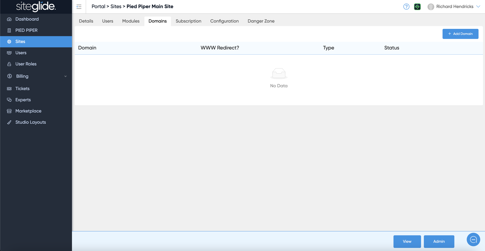
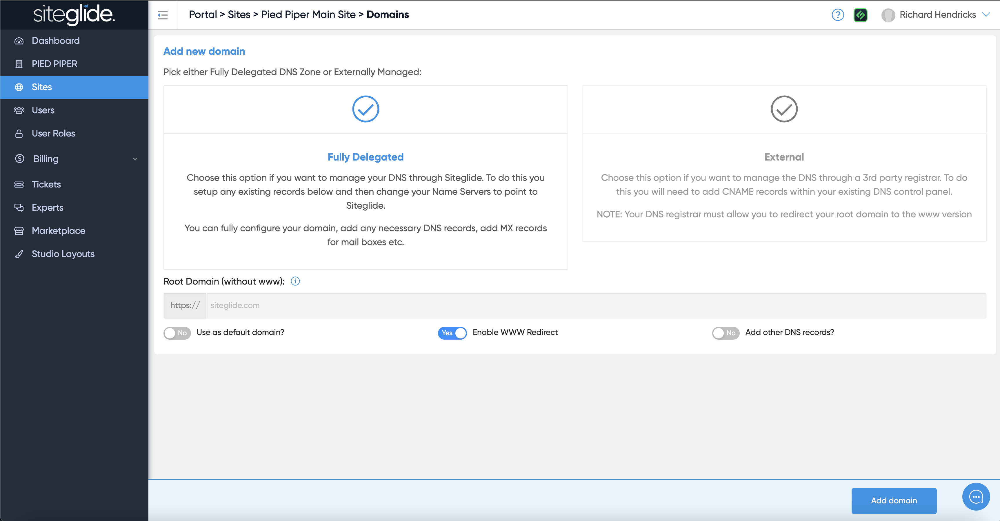
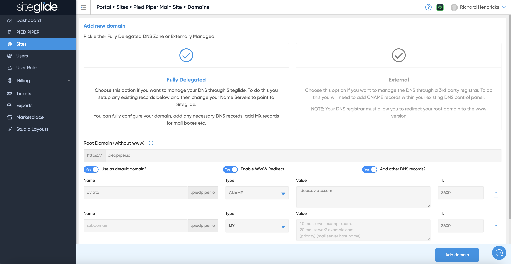
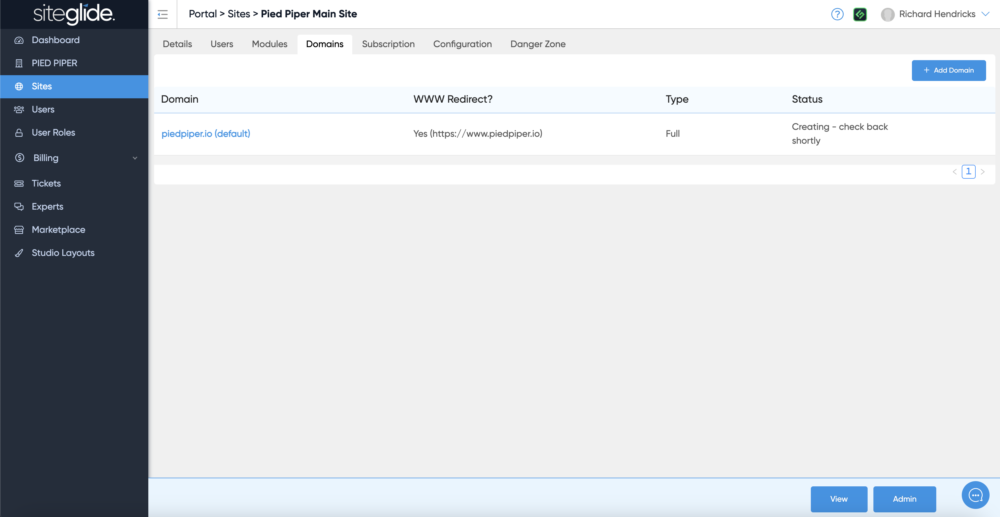
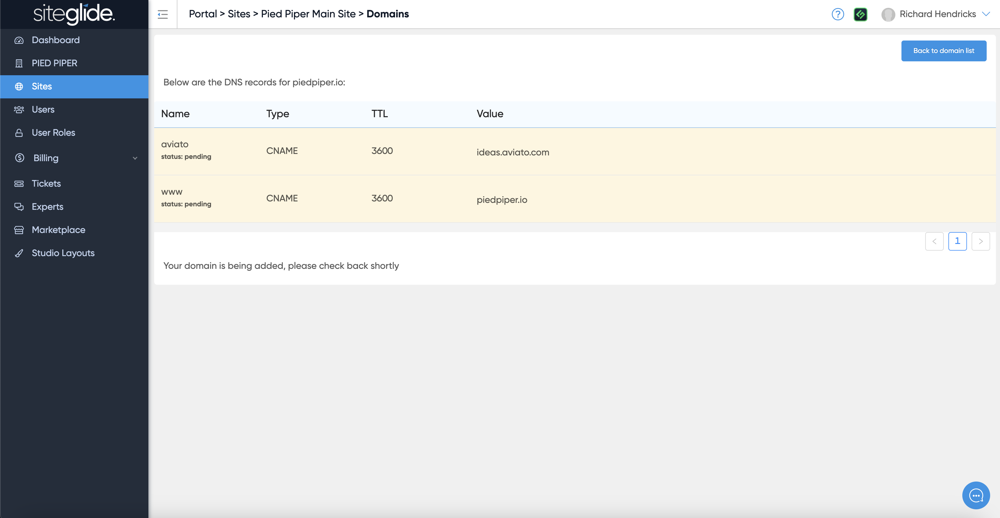
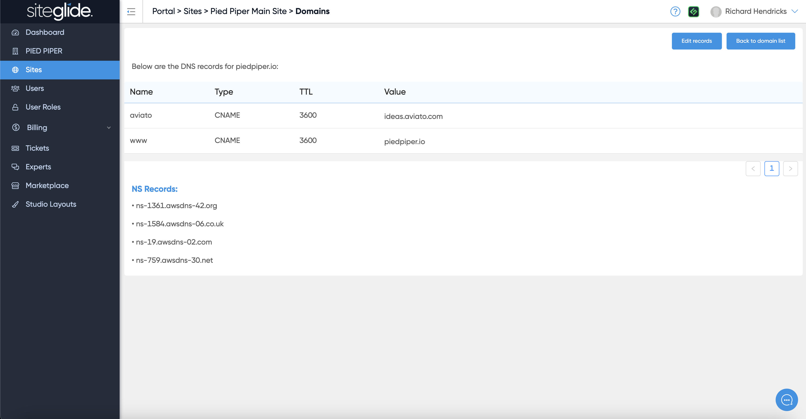
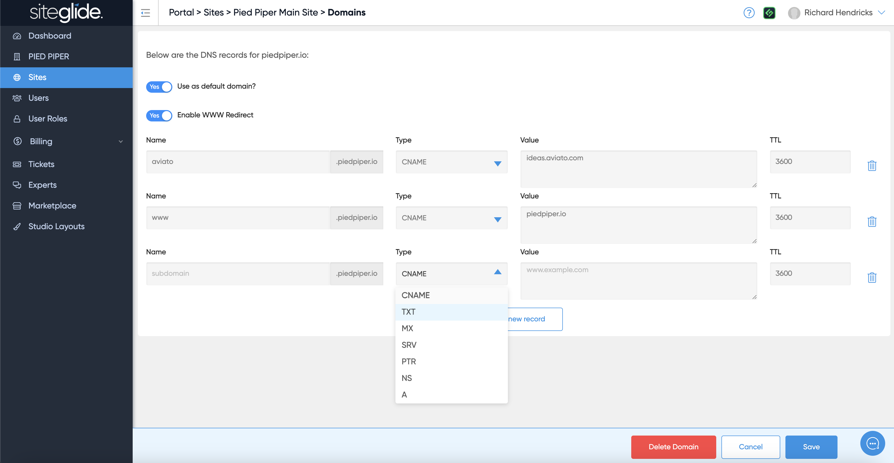

# Add a Fully Delegated Domain

## Step 1: Add a Domain

Navigate to the Domains tab on the Site and click Add Domain:

<figure><figcaption></figcaption></figure>

## Step 2: Choose Fully Delegated


Not sure which? Please read the pros and cons of each first: [fully-delegated-vs-external-dns.md](fully-delegated-vs-external-dns.md "mention")


Just click the Fully Delegated box:

<figure><figcaption></figcaption></figure>

Once you select Fully Delegated you need to type in your root domain (without www) and then decide if it's going to be your default domain (most likely):

<figure><figcaption></figcaption></figure>

You should also ensure 'Enable WWW Redirect is on unless you're adding a subdomain. Finally you can choose to add other DNS records but you can always do this later too. If you toggle to add them now you just add records and fill in the fields.

## Step 3: Wait for it to process

Sit back and relax or go and make a coffee while the system does the work!

<figure><figcaption></figcaption></figure>

If you click the domain at this stage you'll just see the records you've added as Pending, there's nothing you can do at this stage so go grab that coffee!

<figure><figcaption></figcaption></figure>

## Step 4: Change the Nameservers

You can refresh the page until you see the Status as 'Awaiting Propagation':

<figure><figcaption></figcaption></figure>

Then click into the domain and you'll see any records you've added plus the NS Records you need to add in your Domain Control Panel (GoDaddy etc):


Please ensure you've copied ALL existing DNS records from your current provider into Siteglide otherwise important services such as Email might fail.


<figure><figcaption></figcaption></figure>

To add more Records just click Edit Records and add new rows as required:

<figure><figcaption></figcaption></figure>

## Step 5: Wait and Check it's Propagated

No matter how many times you've put sites live you'll no doubt be refreshing and questioning if it's worked from the moment you change the Nameservers!

Typically you'll see some positive signals within minutes but you really do need to give it an hour or so (registrars will say 24-48 hours) before stepping in.

We recommend using the following tools to monitor propagation:




