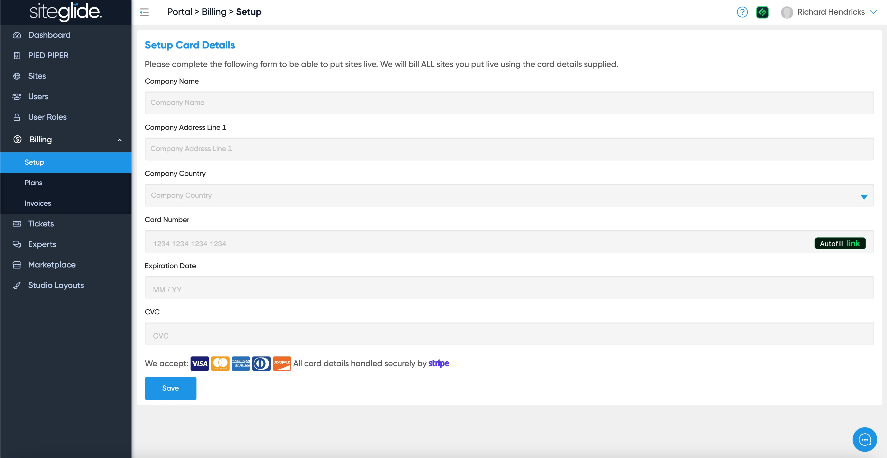

# 💳 Go Live

Great news! You're ready to Go Live? Just follow these steps or contact us if you get stuck.

## Step 1: Billing Setup

Head to the Go Live tab on the Site in the Siteglide Portal, if this is your first Site you'll likely see a message asking you to add your billing information:

<figure><figcaption></figcaption></figure>

Just click the link which will take you to the Billing Setup page, you just need to fill out the form:

<figure><figcaption></figcaption></figure>

More information on Billing Setup:


[billing-setup.md](../billing/billing-setup.md)


## Step 2: Check Usage

The Subscription tab will show your current usage and recommend which plan you need, it'll only suggest the lowest plan that your Site currently fits into. We'd recommend considering picking a higher plan if you know usage is going to increase, this will help avoid paying overages:

<figure><figcaption></figcaption></figure>

## Step 3: Go Live

On the Go Live tab there are a few options, firstly pick your currency then select the Plan (based on Step 2) and finally pick your preferred/closest Datacenter (this cannot be changed).

<figure><figcaption></figcaption></figure>

The button will not turn blue until you've selected a Plan:

<figure><figcaption></figcaption></figure>

It will then confirm the last 4 digits of the card that will be used and that you will be charged pro-rata for the remainder of the month based on the selected plan. When ready click Start Subscription. Please contact us if you are unsure about any of these steps, we cannot make changes once the site is Live.

## Next Steps:

Ready to add your domain?


[domains](domains/)

