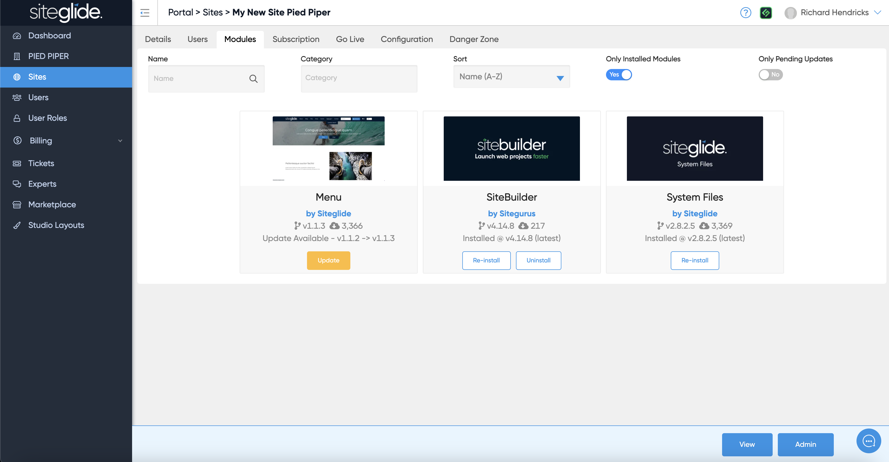
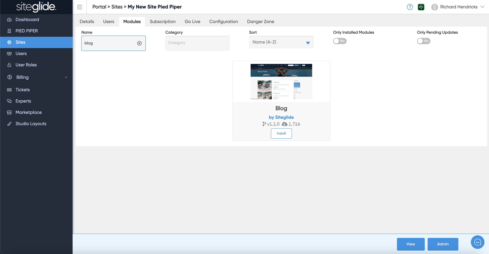
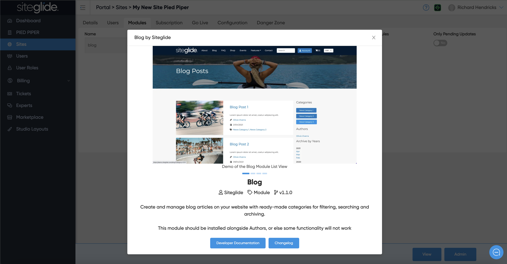

# 📋 Install & Manage Modules

Go to a specific site in Portal and click the Modules tab. This will show all Modules in the Marketplace but it will not show Marketplace Templates because they cannot be installed onto an existing site).

You can filter to see which Modules are installed:


We recommend keeping Modules Updated (yellow Update button shows an update is available), read more on managing Modules: [updating-existing-modules.md](../../developer-tools/building-for-marketplace/updating-existing-modules.md "mention")


<figure><figcaption></figcaption></figure>

You can filter in the Name field if you're looking for a specific module:

<figure><figcaption></figcaption></figure>

Clicking a module will give you more information:

<figure><figcaption></figcaption></figure>

When ready just click install to install it to that site.

## Next Steps:


[installing-layouts.md](../../sitebuilder/setup-sitebuilder/installing-layouts.md)

