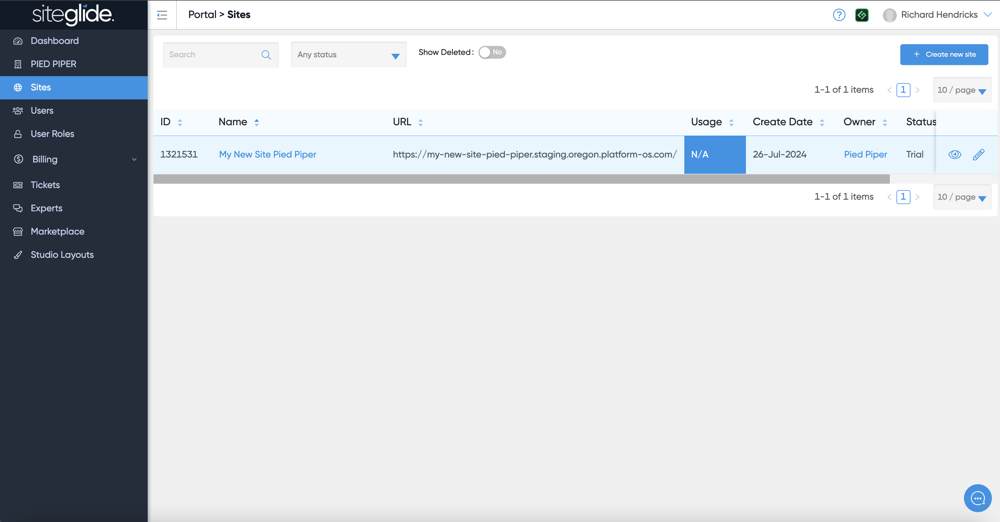
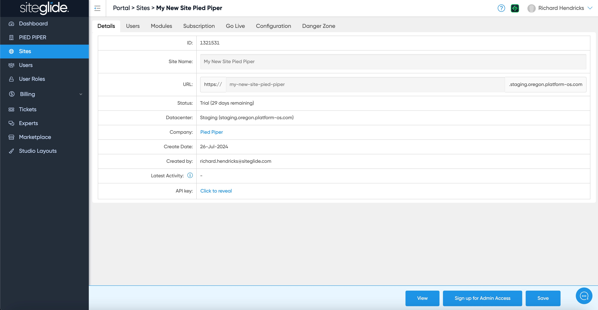

# ℹ️ Site Details

Click the 'Sites' button in the left hand menu in Portal to see your list of sites, then click the Name of the site you want to view the settings for:

<figure><figcaption></figcaption></figure>

This is where you manage the site including Users, Modules and the Subscription:

<figure><figcaption></figcaption></figure>

## **Details Fields:**

* **ID** - Unique identifier for this site
* **Site Name** - Name of the site - this can be edited
* **URL** - The site's live or developmental URL - this can be edited (keeping the same format. e.g. Staging/Trial Sites = https://sitename.staging.oregon.platform-os.com/ and Production/Live Sites = https://sitename.prod01.oregon.platform-os.com/ )
* **Status** - This will be 'Trial', 'Trial Expired - Locked', 'Trial Expired - Redirected' or 'Live'.
* **Datacenter** - One of three datacenters that was picked when this site was created (London, Oregon, Sydney)
* **Company** (listed as Owner in 'Sites' area) - The Agency or Client that owns this site
* **Create Date** - The date that this site was created
* **Created By** - Email address of the user that created this site
* **Latest Activity** - The date that this site was last edited
* **API Key** - You can click here to reveal your key
* **CLI Command** - A shortcut to add this Site to CLI to begin working with, e.g:

```
siteglide-cli add staging --email richard.hendricks@siteglide.com --url https://my-new-site-pied-piper.staging.oregon.platform-os.com/
```

**Note:** _Here, you can also see how long is left on your trial. When your trial has reached 0, an email will be sent out to the agency who owns this site, and this site will enter the expiry flow._

* You can extend this trial by clicking 'extend' next to the Status. Sites will automatically extend their trial when users visit this site's admin or connect to this site via CLI.
* After 14 days of this trial being locked and with no user extending this trial; a reminder email is sent out and this Site will now redirect to https://www.siteglide.com/ .
* After 13 days of this trial being redirected; another reminder email is sent to notify the agency owner that this Site will be deleted if no action is taken.
* After 1 day of this second email being sent out, this trial Site will be locked and greyed out in Siteglide.
* Within 24 hours of this site being greyed out, this Site will be fully deleted.

Using the buttons at the bottom, you can also 'View' this site, edit this Site's 'Admin', 'Save' any changes made to the name or URL, or 'Delete Site'.
