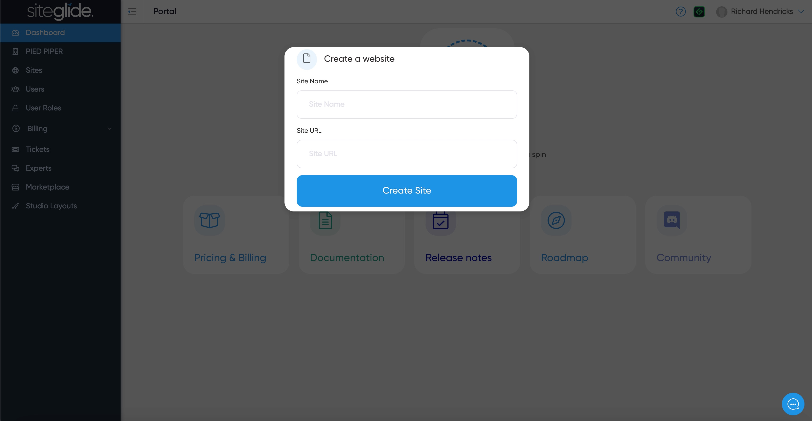

# 🚀 Quickstart: Create a Site

This guide will walk you through the process of creating a new site using Siteglide's admin area.

## Step 1: Access the Dashboard

Once you're logged into the portal, you'll find yourself on the dashboard.

If you don't see a 'Create a Website' button (as per 2nd screenshot) please contact us via Live Chat to prove you're human and we'll get you setup!

<figure><figcaption>
Contact us to prove you're human and we'll get your account approved!
</figcaption></figure>

Once you're account is approved you should see the Create a Website button:

<figure><figcaption>
Click 'Create a Website'
</figcaption></figure>

If you already have 1 or more site you'll see options to create a site, manage existing sites, or manage your company:

<figure><figcaption>
Click 'Create New Site'
</figcaption></figure>

## Step 2: Choose Site Creation Method

You have the option to create a new site from scratch or use a Template.&#x20;

<figure><figcaption></figcaption></figure>

If you're new to Siteglide or less technical, it's recommended to start with a template because they're built with SiteBuilder, a tool to help you rapidly build and customise websites:


[quickstart-sitebuilder.md](../../sitebuilder/setup-sitebuilder/quickstart-sitebuilder.md)



Please follow the above link if you're new to Siteglide


The rest of this Quickstart guide will focus on building a Custom Site. Click the 'Build a Custom Site' button.

## Step 3: Name your Custom Site

Give the site a name and it will automatically create the URL. You will need to ensure it's unique, if it turns red please amend by making it more unique. Then click Create Site.

<figure><figcaption></figcaption></figure>

## Step 5: Manage Your New Site Once Ready

And that's it! You've successfully created a new site, you will need to wait for it to be ready to use:

<figure><figcaption>
Once you get the email confirming it's ready you will need to refresh this page or click the link from the email
</figcaption></figure>

You will receive an email when it's done but can also find it under the Sites area:

<figure><figcaption></figcaption></figure>

The Status will show as Trial and there will be a new blue button in the bottom bar that will likely say Sign up for Admin Access if you've not yet used it, otherwise it'll say Admin going forwards:

<figure><figcaption>
Click Sign up for Admin Access and you'll then be on the Site Dashboard
</figcaption></figure>

## Next Steps:

Click through to Administer the Site and you'll end up on the Dashboard:


[dashboard.md](../../cms/dashboard.md)


If you're a developer you'll likely want to set up our CLI:


[quickstart.md](../../developer-tools/cli/quickstart.md)

