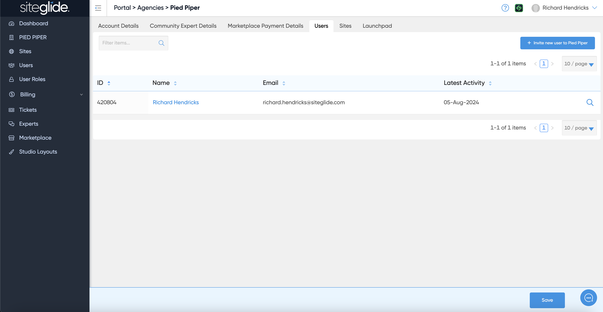
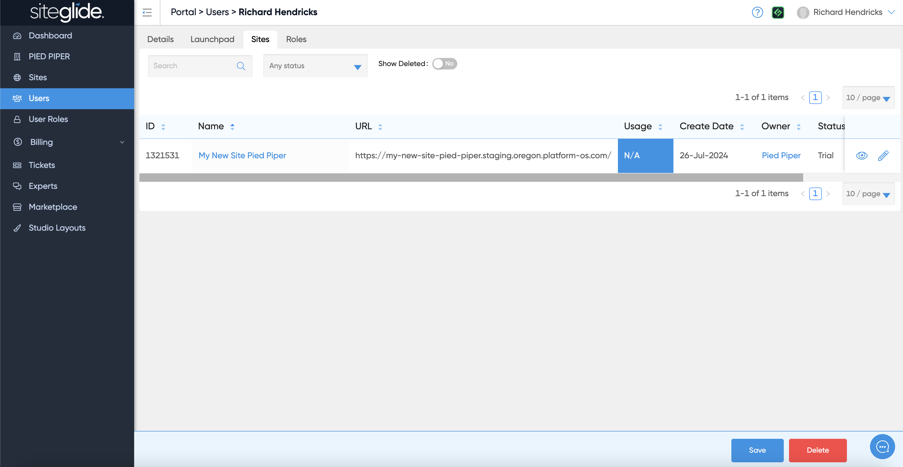

# 📋 Invite & Manage Users

This is where you manage Account users, they would get access to all sites in your Portal

## Invite Portal Users

To invite users to your Account you can only do this from the Users tab on your Account (your company name in the left menu):

<figure><figcaption></figcaption></figure>

You will not see the blue invite button on the Users page (left hand menu Users link):

<figure><figcaption></figcaption></figure>

If you click a user you can see what Sites they have access to and their User Role:

<figure><figcaption></figcaption></figure>

<figure><figcaption></figcaption></figure>

Find out more on Users and User Roles:


[.](./)

