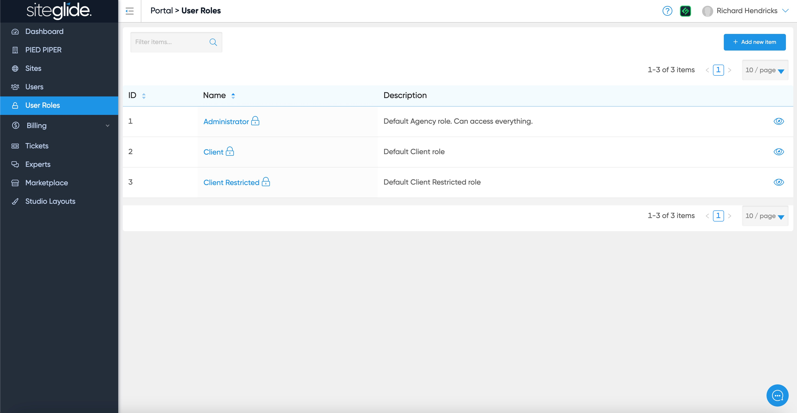
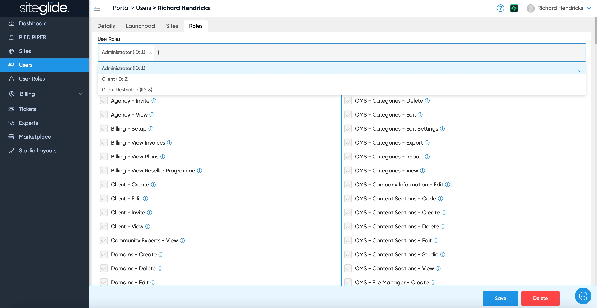
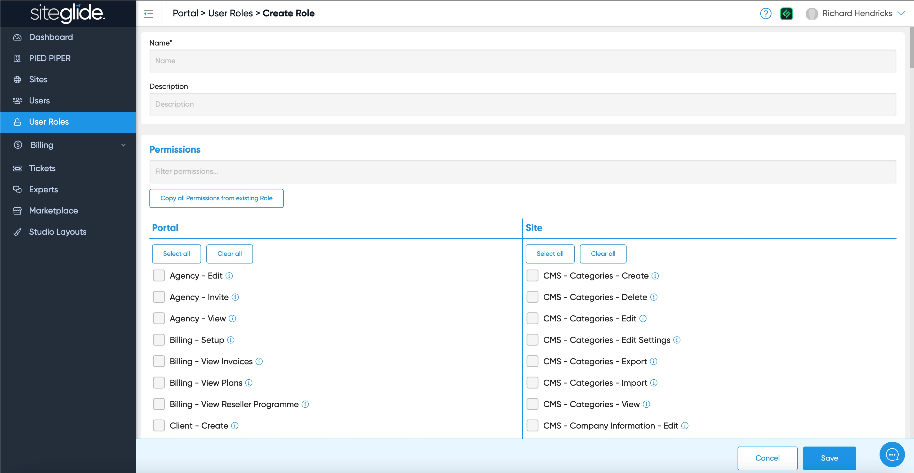

# 📋 User Roles

User Roles determine what users can see and do within Siteglide. Account owners have granular control over this and can set others as Admins or limit what they can do.

## Manage Roles

<figure><figcaption></figcaption></figure>

You can then change or add additional Roles for that User:

<figure><figcaption></figcaption></figure>

Roles stack, so you can have multiple different roles and receive a combination of permissions. This allows you to split your desired permissions into blocks, and apply them where needed without having to create specific roles for every user.

## Create a New User Role

To create a New Role just give it a name and select the granular controls they have access to:

<figure><figcaption></figcaption></figure>

You can also copy permissions from an existing role to save time:

<figure><figcaption></figcaption></figure>

## See Roles Assigned to Users

You can see what Role a User has by clicking the Roles tab on a User:

<figure><figcaption></figcaption></figure>

## Access limits based on 'User Level'

A user has a 'User Level' of either 'Agency' or 'Client'. This is independent of their precise roles, and inflicts some limitations that are permanent and cannot be overcome by editing User Roles.

If the User Level is set to 'Client', then the Portal view is limited to:

Site List Site Details Client Profile User Profile Billing Setup, Plans, and Invoices (only shows if paying Siteglide directly)

Other restrictions:

Gist/Live Chat - Cannot access, so they have no direct line of communication with Siteglide and must instead to their agency Sites - Cannot see status, so they're not informed of any billing issues (Payment Failed) Billing - Cannot see anything related to Reseller Programme Client - Cannot edit 'Payee' to set to themselves as paying Siteglide directly

Site view has no limitations, and a client user has the same feature access as an agency user (unless limited via User Roles)

## Next Steps:


[invite-and-manage-users.md](invite-and-manage-users.md)

