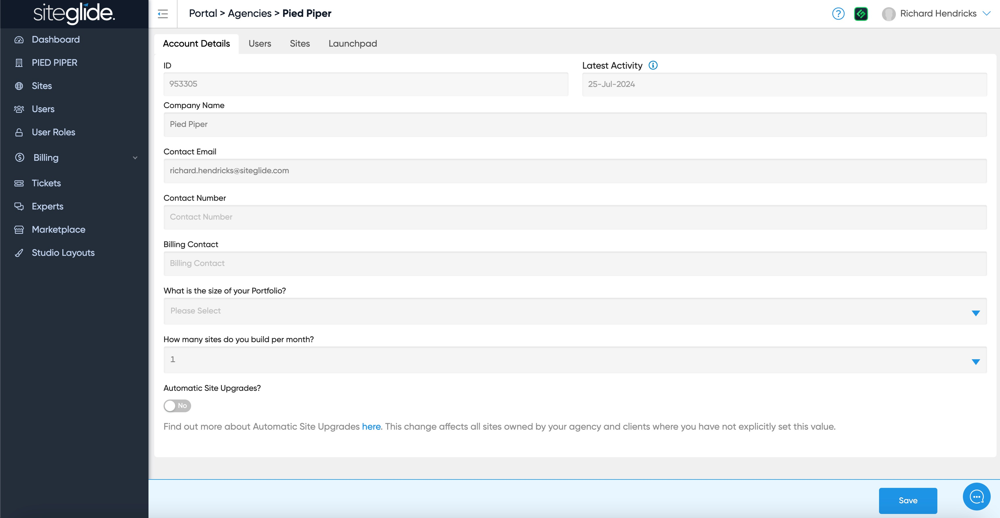
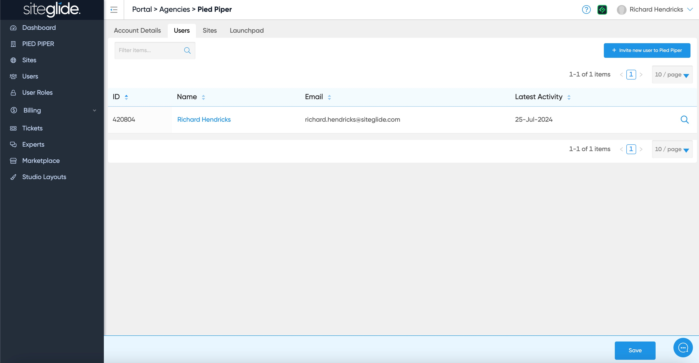
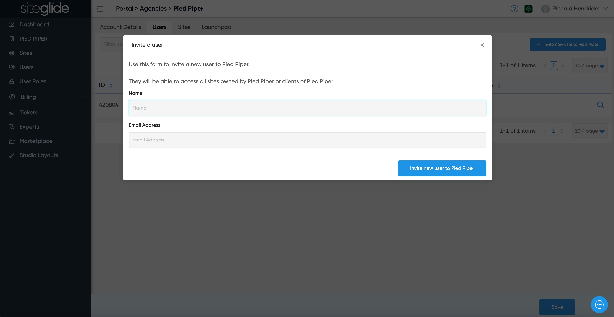
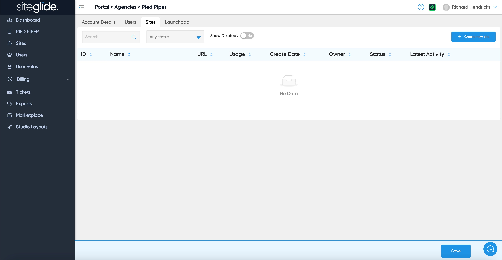
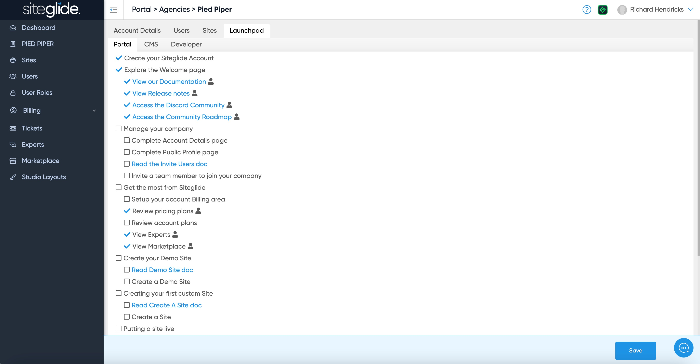

# Account

You can manage your company profile and account settings here:

<figure><figcaption></figcaption></figure>

This is also where you invite Account level users who have access to all sites:


Want to invite users to an individual Site only?: [site-users.md](../portal/sites/site-users.md "mention")


<figure><figcaption></figcaption></figure>

Simply add a name and email address of a person you'd like to add to the Account:

<figure><figcaption></figcaption></figure>

This shows all the Sites directly under your account (this will not show any Sites in Client folders):


Want to see all sites you have access to? [sites](../portal/sites/ "mention")


<figure><figcaption></figcaption></figure>

Launchpad shows you how much of Siteglide you've used and setup. It's a great way to ensure your team learns the platform:

<figure><figcaption></figcaption></figure>

