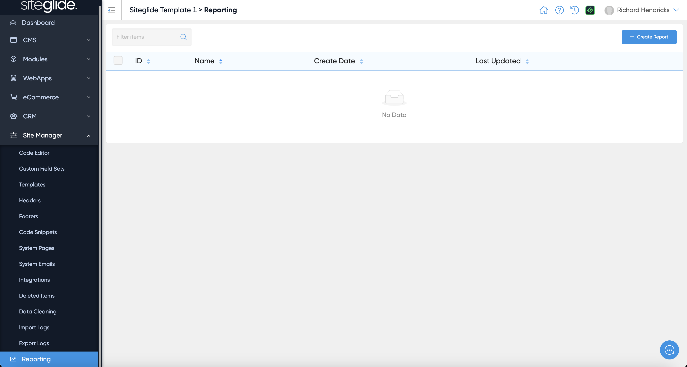
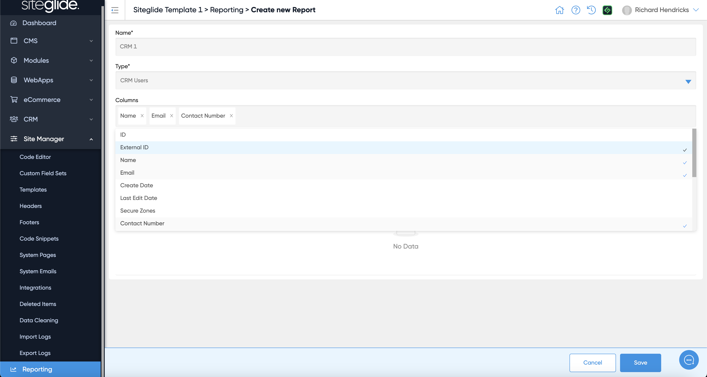
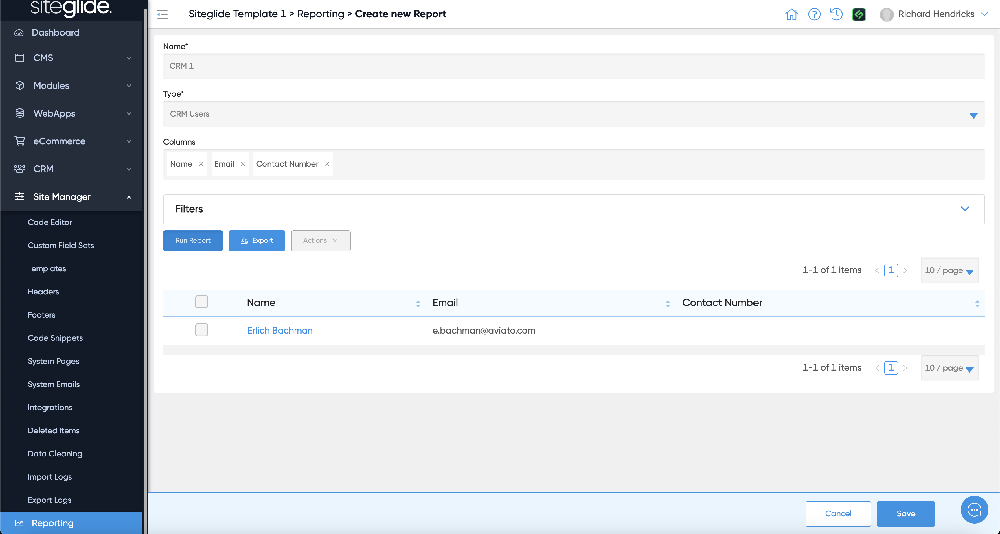
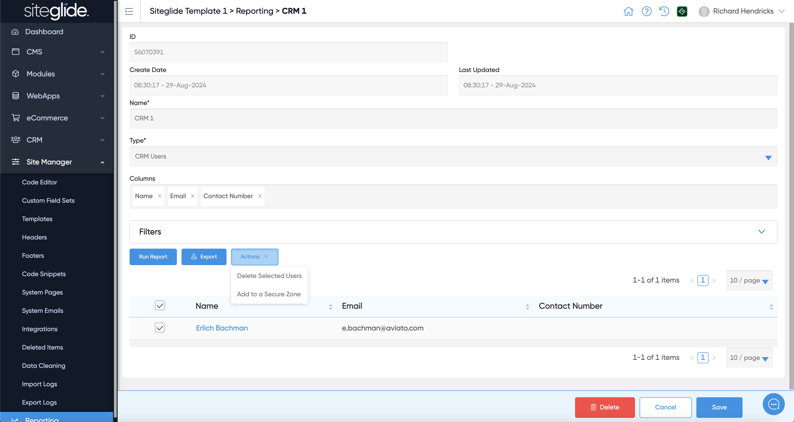
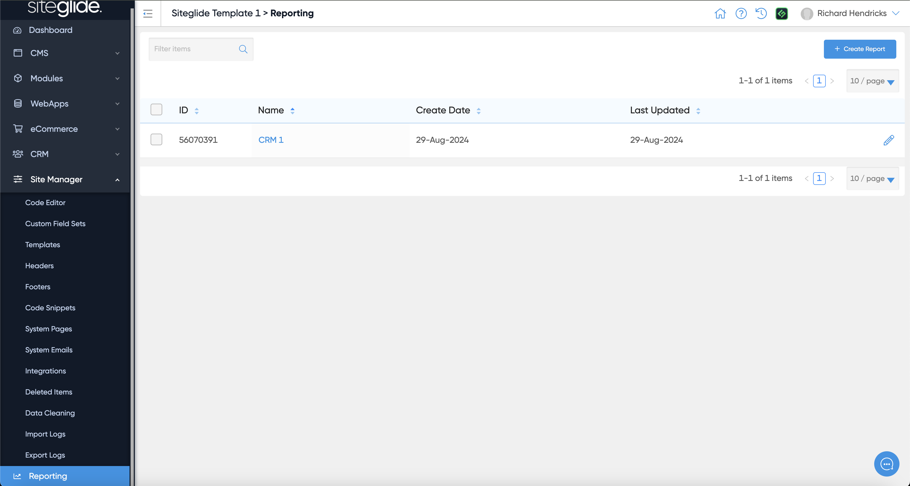

# 🚀 Quickstart: Reports

The Reporting tool allows you to build dynamic reports related to CRM usage and Form Cases. You can choose which Fields to include and filter the results. Once a Report is Saved you can go back to this at any time and see the results with live data.

If you've not created any reports this area will be blank:

<figure><figcaption></figcaption></figure>

## Step 1: Create a Report

When creating a new Report simply give it a name, decide if you're querying the CRM Users Database or the Cases Database and then pick the Fields you want to include:

<figure><figcaption></figcaption></figure>

## Step 2: Run the Report

You can then run the Report and see the results.

<figure><figcaption></figcaption></figure>

## Step 3: Export or Apply Actions

You can also Export the Results and perform Actions on the results:

<figure><figcaption></figcaption></figure>

## Step 4: Revisit Saved Reports

Once a Report is saved it will appear in the List:

<figure><figcaption></figcaption></figure>
