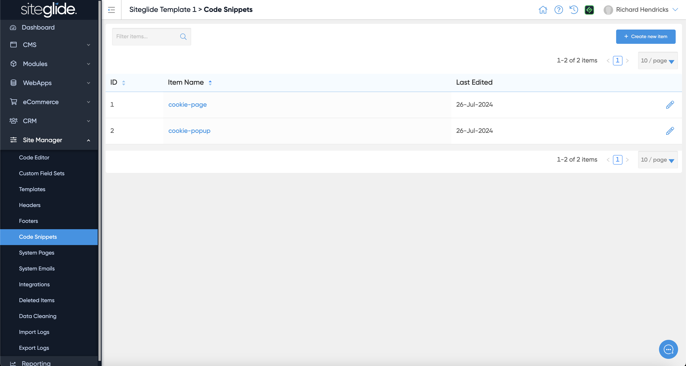
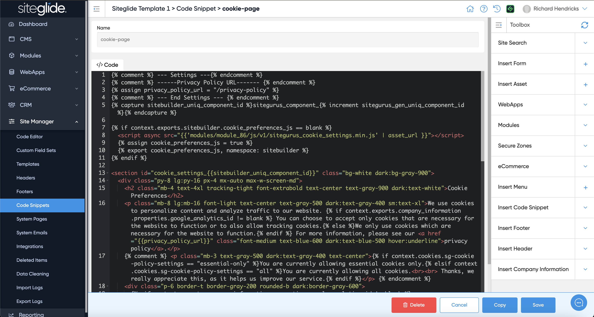

# Code Snippets (Includes)

Code Snippets are also referred to more globally as Includes because they're files that can be included in Pages, Templates, Headers/Footers etc. They're useful for things like external Javascript for Google Analytics as an example or Cookie Consent as in our Template Site:

<figure><figcaption></figcaption></figure>

They can be edited in Admin to leverage the Toolbox functionality or via CLI:

<figure><figcaption></figcaption></figure>

