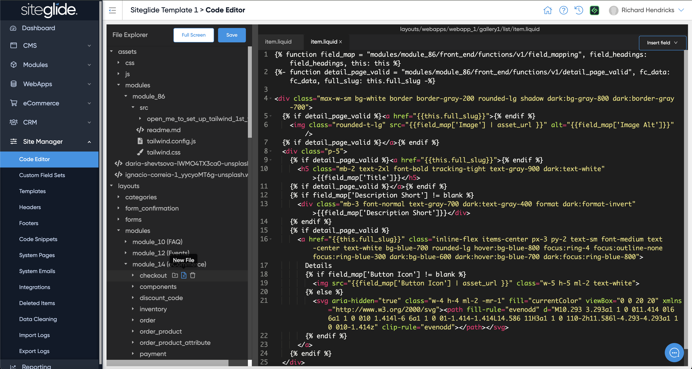

# Code Editor


We recommend using CLI instead of Code Editor: [quickstart.md](../developer-tools/cli/quickstart.md "mention")



If working in both Code Editor/Admin and CLI be careful to ensure you Pull via CLI after making any changes in Admin. Also ensure you refresh Admin if you've made changes via CLI.


The Code Editor allows you to quickly access Layouts and other files to make changes. Everything that can be accessed here is accessible in CLI and more. CLI offers better editing capabilities and allows you to customise the experience using your preferred IDE (we recommend VS Code).

<figure><figcaption></figcaption></figure>
