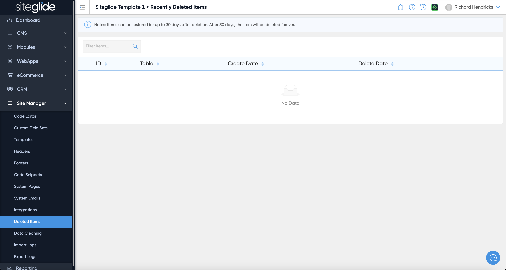
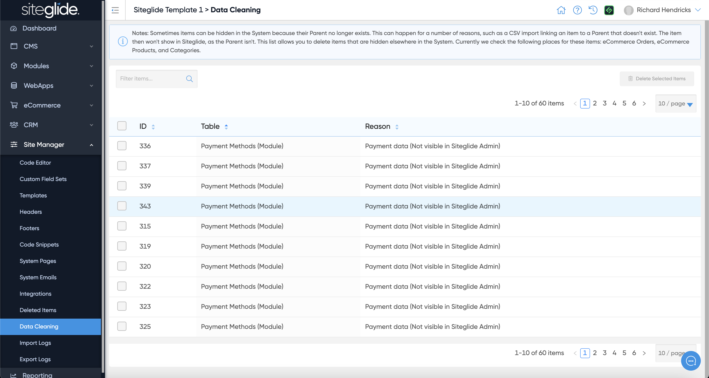

# Data Management

We have some useful Data Management tools including Deleted Items and Data Cleaning.

Recently Deleted Items will list database items that have been deleted in the last 30 days. This includes CRM Contacts, Cases, Module Items, WebApp Items and more. Please be aware that they will only appear in this list for 30 days from deletion before being deleted irreversibly:

<figure><figcaption></figcaption></figure>

The Data Cleaning feature will highlight any items that are no longer needed and often have become disconnected (orphaned) from other items in Siteglide. For example we keep a record of data during eCommerce purchases but you will likely not need to keep these once the order has been processed successfully:

<figure><figcaption></figcaption></figure>
