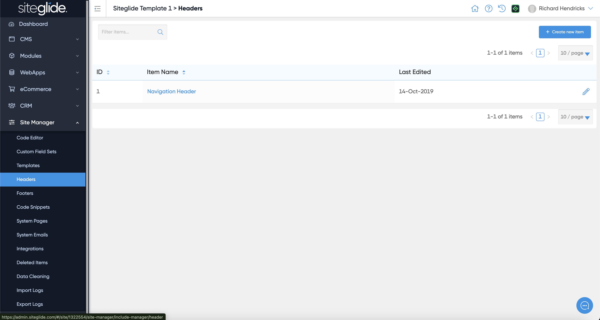
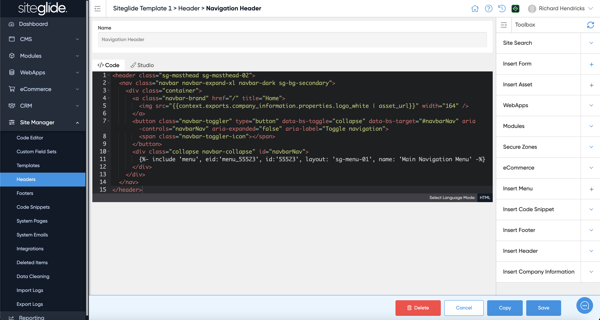
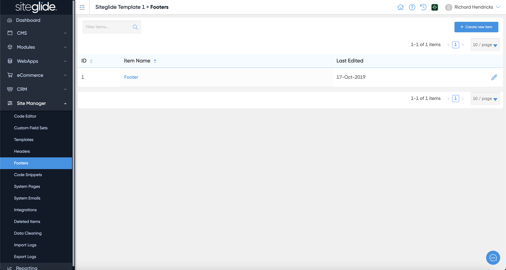
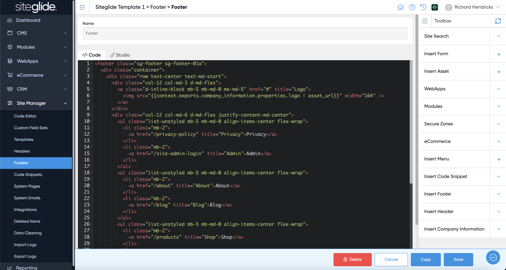

# Headers & Footers

Headers and Footers are simply content areas to help you split out the Header and Footer code from the rest of the Template/Pages.

It would likely contain the whole Header strip (including navigation) or the whole Footer Strip.

<figure><figcaption></figcaption></figure>

It can be managed in Admin or via CLI:

<figure><figcaption></figcaption></figure>

Footers work in exactly the same way, it's just separated for ease of finding them and adding them to Templates.

<figure><figcaption></figcaption></figure>

You would likely insert a Menu from Toolbox but we'd recommend most changes are done via CLI:

<figure><figcaption></figcaption></figure>
