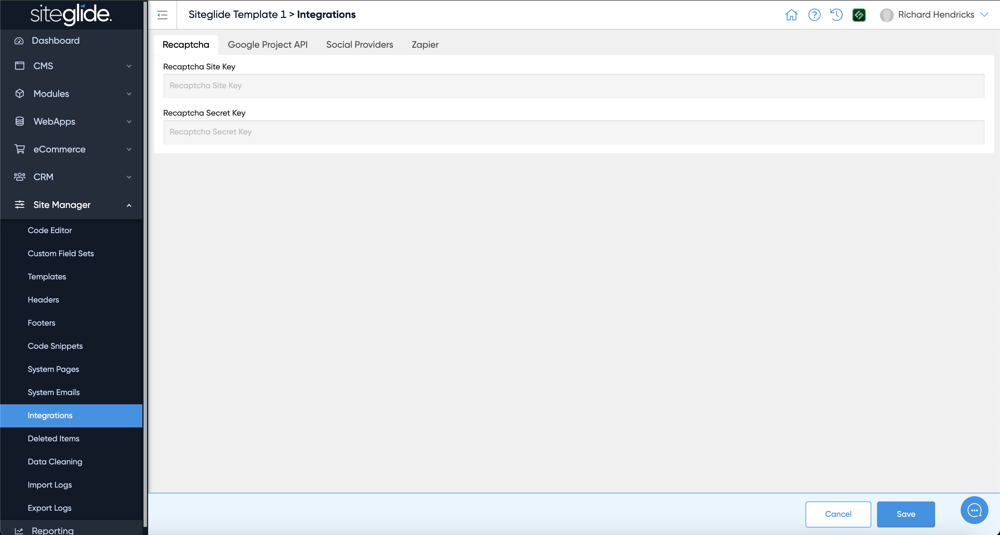

# Integrations

The Integrations area lets you manage various tools such as Recaptcha, Google APIs, Social Media Providers and Zapier.

You typically need to insert your API keys to make the integration work:

<figure><figcaption></figcaption></figure>

The Zapier Integration includes pre-built workflows to help you speed up your integrations:

<figure><figcaption></figcaption></figure>
